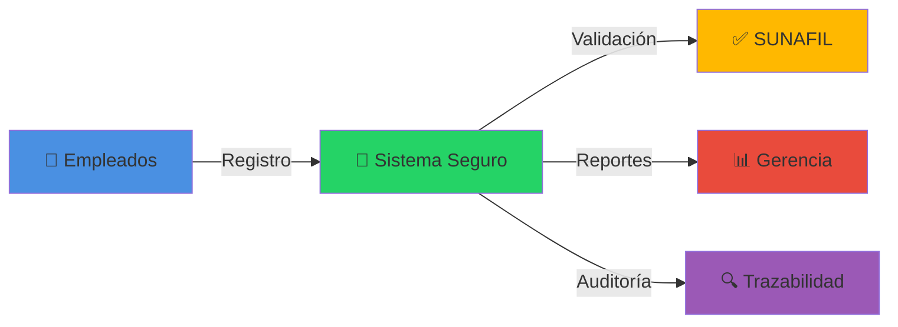
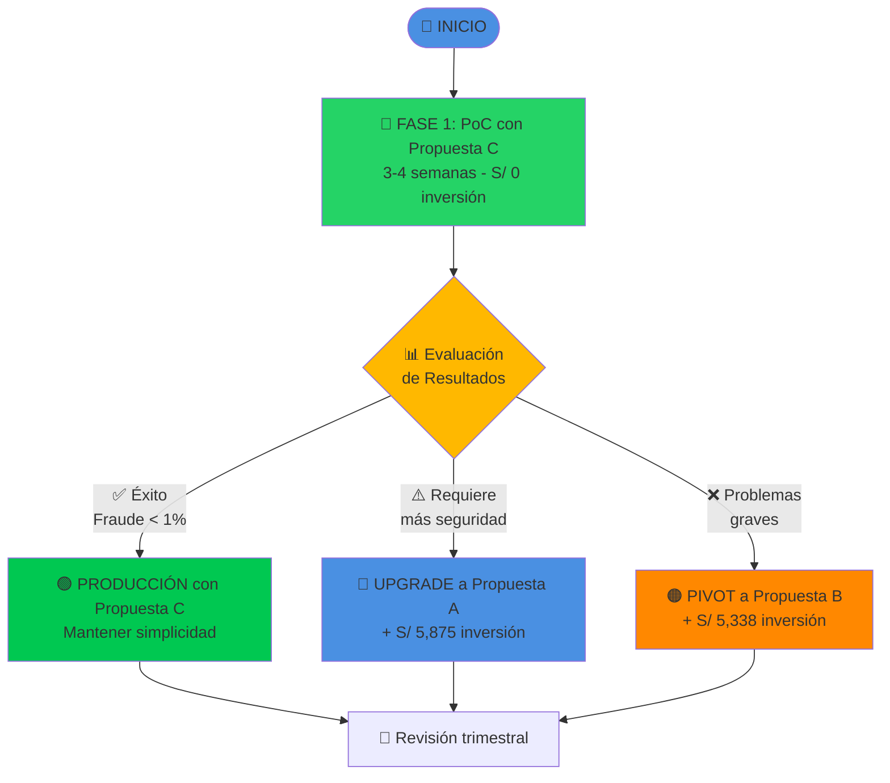
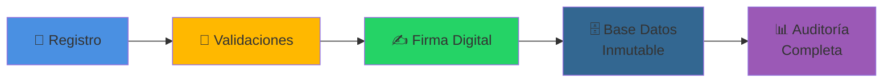
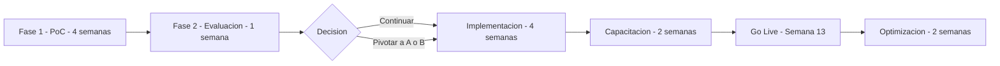

# 📋 RESUMEN EJECUTIVO
## Sistema de Control de Asistencia Compatible con SUNAFIL

---

<div align="center">


</div>

---

## 🎯 PROBLEMA DE NEGOCIO

### Situación Actual

<table>
<tr>
<td width="50%" valign="top">

#### ❌ Desafíos Operativos

- **Control manual** propenso a errores humanos
- **Reportes tediosos** que consumen horas de trabajo
- **Riesgo de suplantación** sin verificación robusta
- **Imposibilidad de auditoría** efectiva
- **Falta de trazabilidad** para inspecciones SUNAFIL

</td>
<td width="50%" valign="top">

#### 💰 Impacto Financiero

- **15 horas/mes** en reportes manuales
- **Riesgo de multas SUNAFIL**: S/ 2,000 - S/ 50,000
- **Pérdida de productividad** por registro ineficiente
- **Costos ocultos** en correcciones y ajustes

</td>
</tr>
</table>

---

## 💡 SOLUCIÓN PROPUESTA

Implementar un **sistema digital de control de asistencia** que:

<div align="center">



</div>

### ✅ Beneficios Clave

<table>
<tr>
<td align="center" width="25%">

### 🎯
**CUMPLIMIENTO**

Garantía total de conformidad con normativa SUNAFIL

</td>
<td align="center" width="25%">

### ⚡
**EFICIENCIA**

Reportes automáticos en segundos, no horas

</td>
<td align="center" width="25%">

### 🔒
**SEGURIDAD**

Imposibilidad de fraude con validaciones múltiples

</td>
<td align="center" width="25%">

### 📈
**VISIBILIDAD**

Dashboard gerencial en tiempo real

</td>
</tr>
</table>

---

## 🔄 TRES PROPUESTAS EVALUADAS

Hemos desarrollado **3 alternativas** que cumplen con SUNAFIL, con diferentes balances entre **costo**, **seguridad** y **flexibilidad**:

### Tabla Comparativa Rápida

<table>
<thead>
<tr>
<th width="25%">Característica</th>
<th width="25%" align="center">🔵 PROPUESTA A<br/><sub>Híbrida</sub></th>
<th width="25%" align="center">🟠 PROPUESTA B<br/><sub>Comercial</sub></th>
<th width="25%" align="center">🟢 PROPUESTA C<br/><sub>WhatsApp</sub></th>
</tr>
</thead>
<tbody>

<tr>
<td><strong>💰 Inversión Inicial</strong></td>
<td align="center">
<strong>S/ 3,980</strong><br/>
⭐⭐⭐
</td>
<td align="center">
<strong>S/ 5,338</strong><br/>
⭐⭐⭐
</td>
<td align="center">
<strong>S/ 2,500</strong><br/>
⭐⭐⭐⭐
</td>
</tr>

<tr>
<td><strong>📅 Costo Anual</strong></td>
<td align="center">
<strong>S/ 1,950</strong><br/>
~S/ 162/mes
</td>
<td align="center">
<strong>S/ 1,950</strong><br/>
~S/ 162/mes
</td>
<td align="center">
<strong>S/ 1,950</strong><br/>
~S/ 162/mes
</td>
</tr>

<tr>
<td><strong>🔐 Seguridad</strong></td>
<td align="center">
<strong>Alta</strong><br/>
Biometría física + 5 validaciones remotas
</td>
<td align="center">
<strong>Muy Alta</strong><br/>
Equipo certificado + 5 validaciones
</td>
<td align="center">
<strong>Alta</strong><br/>
8 validaciones digitales
</td>
</tr>

<tr>
<td><strong>⏱️ Implementación</strong></td>
<td align="center">
<strong>6-8 semanas</strong>
</td>
<td align="center">
<strong>4-6 semanas</strong>
</td>
<td align="center">
<strong>3-4 semanas</strong>
</td>
</tr>

<tr>
<td><strong>🎯 Ideal Para</strong></td>
<td align="center">
Empresas con oficina física y remotos
</td>
<td align="center">
Grandes empresas, múltiples sedes
</td>
<td align="center">
Startups, equipos distribuidos
</td>
</tr>

<tr>
<td><strong>🔧 Mantenimiento</strong></td>
<td align="center">
<strong>Medio</strong><br/>
Hardware + software
</td>
<td align="center">
<strong>Bajo</strong><br/>
Soporte fabricante
</td>
<td align="center">
<strong>Muy Bajo</strong><br/>
Solo software
</td>
</tr>

<tr>
<td><strong>📈 Escalabilidad</strong></td>
<td align="center">
Alta<br/>
Limitado por lectores
</td>
<td align="center">
Alta<br/>
Agregar equipos
</td>
<td align="center">
<strong>Ilimitada</strong><br/>
Sin hardware
</td>
</tr>

</tbody>
</table>

---

## 🏆 RECOMENDACIÓN GERENCIAL

<div align="center">

### ⭐ ESTRATEGIA RECOMENDADA ⭐



</div>

### ¿Por qué esta estrategia?

<table>
<tr>
<td width="50%" valign="top">

#### 🎯 Ventajas de Comenzar con Propuesta C

1. **Inversión Cero**: Sin compromiso financiero inicial
2. **Validación Rápida**: 3-4 semanas para comprobar viabilidad
3. **Aprendizaje**: Entender necesidades reales antes de invertir
4. **Flexibilidad**: Fácil pivot si no cumple expectativas
5. **Escalabilidad**: Funciona desde 5 hasta 500+ empleados

</td>
<td width="50%" valign="top">

#### 📊 Criterios de Decisión Post-PoC

| Resultado PoC | Acción Recomendada |
|---------------|-------------------|
| **Tasa fraude < 1%**<br/>UX satisfactoria | ✅ Continuar con C |
| **Tasa fraude 1-5%**<br/>Quejas menores | 🔵 Migrar a A |
| **Tasa fraude > 5%**<br/>Problemas graves | 🟠 Migrar a B |

</td>
</tr>
</table>

---

## 💼 ANÁLISIS FINANCIERO

### Comparativa de Costos (3 años)

<table>
<thead>
<tr>
<th>Concepto</th>
<th align="right">🔵 Propuesta A</th>
<th align="right">🟠 Propuesta B</th>
<th align="right">🟢 Propuesta C</th>
</tr>
</thead>
<tbody>
<tr>
<td><strong>Año 0 (Inversión inicial)</strong></td>
<td align="right">S/ 3,980</td>
<td align="right">S/ 5,338</td>
<td align="right">S/ 2,500</td>
</tr>
<tr>
<td><strong>Año 1 (Operativo)</strong></td>
<td align="right">S/ 1,950</td>
<td align="right">S/ 1,950</td>
<td align="right">S/ 1,950</td>
</tr>
<tr>
<td><strong>Año 2 (Operativo)</strong></td>
<td align="right">S/ 1,950</td>
<td align="right">S/ 1,950</td>
<td align="right">S/ 1,950</td>
</tr>
<tr>
<td><strong>Año 3 (Operativo)</strong></td>
<td align="right">S/ 1,950</td>
<td align="right">S/ 1,950</td>
<td align="right">S/ 1,950</td>
</tr>
<tr style="background-color: #f0f0f0; font-weight: bold;">
<td><strong>💰 TOTAL 3 AÑOS</strong></td>
<td align="right"><strong>S/ 9,830</strong></td>
<td align="right"><strong>S/ 11,188</strong></td>
<td align="right"><strong>S/ 8,350</strong> 🏆</td>
</tr>
<tr>
<td><strong>Costo mensual promedio</strong></td>
<td align="right">S/ 273/mes</td>
<td align="right">S/ 311/mes</td>
<td align="right">S/ 232/mes 🏆</td>
</tr>
</tbody>
</table>

### 📈 Retorno de Inversión (ROI)

<table>
<tr>
<td width="50%" valign="top">

#### Ahorros Estimados (Anuales)

- **Reducción tiempo reportes**: 15h/mes → 1h/mes
  - Ahorro: **14 horas × S/ 75/h × 12 meses = S/ 12,600**

- **Evitar multas SUNAFIL**:
  - Riesgo actual: **10% × S/ 18,750 = S/ 1,875/año**

- **Reducción errores administrativos**:
  - Ahorro estimado: **S/ 3,750/año**

**TOTAL AHORROS: S/ 18,225/año**

</td>
<td width="50%" valign="top">

#### ROI por Propuesta

```
Propuesta A:
Inversión Año 1: S/ 5,930
Ahorro Año 1: S/ 18,225
ROI Año 1: 207%
Payback: 3.9 meses

Propuesta B:
Inversión Año 1: S/ 7,288
Ahorro Año 1: S/ 18,225
ROI Año 1: 150%
Payback: 4.8 meses

Propuesta C:
Inversión Año 1: S/ 4,450
Ahorro Año 1: S/ 18,225
ROI Año 1: 310%
Payback: 2.9 meses
```

</td>
</tr>
</table>

---

## 📋 CARACTERÍSTICAS COMUNES (Todas las Propuestas)

### ✅ Cumplimiento Regulatorio

<div align="center">

| Requisito SUNAFIL | Cumplimiento |
|-------------------|:------------:|
| Registro obligatorio de entrada/salida | ✅ |
| Identificación inequívoca del trabajador | ✅ |
| Integridad e inalterabilidad del registro | ✅ |
| Disponibilidad inmediata para inspección | ✅ |
| Conservación mínima 5 años | ✅ |
| Trazabilidad completa | ✅ |

</div>

### 🔧 Funcionalidades del Sistema

<table>
<tr>
<td width="50%" valign="top">

#### 📱 Para Empleados

- Registro de entrada/salida simple y rápido
- Confirmación inmediata por WhatsApp
- Historial personal de asistencia
- Notificaciones de horarios rotativos

</td>
<td width="50%" valign="top">

#### 💼 Para Administradores

- Dashboard gerencial en tiempo real
- Gestión de usuarios y horarios
- Reportes automáticos SUNAFIL
- Alertas de ausencias y tardanzas
- Exportación a Excel/PDF

</td>
</tr>
</table>

### 🔐 Seguridad y Trazabilidad

<div align="center">



</div>

- **Registros inmutables**: No se pueden modificar ni eliminar
- **Firma digital**: Cada registro tiene hash SHA-256 único
- **Auditoría completa**: Log de todos los accesos y consultas
- **Backup automático**: Respaldos diarios cifrados

---

## 📊 KPIs Y MÉTRICAS DE ÉXITO

### Objetivos Medibles

<table>
<thead>
<tr>
<th width="30%">KPI</th>
<th width="25%">Línea Base</th>
<th width="25%">Objetivo</th>
<th width="20%">Plazo</th>
</tr>
</thead>
<tbody>
<tr>
<td>⏱️ Tiempo de marcación</td>
<td>30-60 seg (manual)</td>
<td><strong>< 10 seg</strong></td>
<td>Inmediato</td>
</tr>
<tr>
<td>📊 Tiempo generación reportes</td>
<td>15 horas/mes</td>
<td><strong>< 1 hora/mes</strong></td>
<td>3 meses</td>
</tr>
<tr>
<td>🎯 Precisión de registros</td>
<td>85% (errores manuales)</td>
<td><strong>> 99.5%</strong></td>
<td>6 meses</td>
</tr>
<tr>
<td>✅ Cumplimiento SUNAFIL</td>
<td>Parcial</td>
<td><strong>100%</strong></td>
<td>Inmediato</td>
</tr>
<tr>
<td>👥 Satisfacción usuarios</td>
<td>N/A</td>
<td><strong>> 4/5 estrellas</strong></td>
<td>6 meses</td>
</tr>
<tr>
<td>🔒 Intentos de fraude detectados</td>
<td>Desconocido</td>
<td><strong>100% detectados</strong></td>
<td>Continuo</td>
</tr>
</tbody>
</table>

---

## 🗓️ CRONOGRAMA DE IMPLEMENTACIÓN

### Estrategia de 3 Fases (13 semanas totales)

<div align="center">



</div>

### Hitos Críticos

<table>
<tr>
<td align="center" width="25%">

**🚀 SEMANA 1**

Kick-off del PoC
Configuración inicial

</td>
<td align="center" width="25%">

**📱 SEMANA 4**

PoC funcional
Testing con 10 usuarios

</td>
<td align="center" width="25%">

**📊 SEMANA 6**

Decisión GO/NO-GO
Aprobación presupuesto

</td>
<td align="center" width="25%">

**✅ SEMANA 13**

Go Live producción
Monitoreo 24/7

</td>
</tr>
</table>

---

## ⚠️ RIESGOS Y MITIGACIONES

<table>
<thead>
<tr>
<th width="30%">Riesgo</th>
<th width="15%" align="center">Probabilidad</th>
<th width="15%" align="center">Impacto</th>
<th width="40%">Mitigación</th>
</tr>
</thead>
<tbody>
<tr>
<td>🌐 <strong>Fallos de conectividad</strong></td>
<td align="center">🟡 Media</td>
<td align="center">🟡 Medio</td>
<td>Buffer local + sincronización automática cuando se restaure</td>
</tr>
<tr>
<td>🔐 <strong>Intentos de fraude</strong></td>
<td align="center">🟢 Baja</td>
<td align="center">🔴 Alto</td>
<td>Validaciones múltiples (liveness, geolocalización, device fingerprint)</td>
</tr>
<tr>
<td>🗄️ <strong>Pérdida de datos</strong></td>
<td align="center">🟢 Baja</td>
<td align="center">🔴 Crítico</td>
<td>Backups diarios automáticos + replicación de BD</td>
</tr>
<tr>
<td>👥 <strong>Rechazo de usuarios</strong></td>
<td align="center">🟡 Media</td>
<td align="center">🟡 Medio</td>
<td>Capacitación efectiva + UX intuitiva + soporte 24/7</td>
</tr>
<tr>
<td>⚖️ <strong>Incumplimiento SUNAFIL</strong></td>
<td align="center">🟢 Baja</td>
<td align="center">🔴 Crítico</td>
<td>Validación legal previa + auditorías trimestrales</td>
</tr>
<tr>
<td>💰 <strong>Sobrecostos</strong></td>
<td align="center">🟡 Media</td>
<td align="center">🟡 Medio</td>
<td>Presupuesto con 20% contingencia + monitoreo mensual</td>
</tr>
</tbody>
</table>

---

## 📞 PRÓXIMOS PASOS

<div align="center">

### 🎯 Recomendaciones Inmediatas

</div>

<table>
<tr>
<td width="33%" align="center" valign="top">

### 1️⃣
**ESTA SEMANA**

📅 Reunión de stakeholders
✅ Aprobación de estrategia
💰 Asignación de presupuesto

</td>
<td width="33%" align="center" valign="top">

### 2️⃣
**PRÓXIMA SEMANA**

🚀 Inicio del PoC (Propuesta C)
👥 Selección de usuarios piloto
🔧 Configuración inicial

</td>
<td width="33%" align="center" valign="top">

### 3️⃣
**SEMANA 5**

📊 Evaluación de resultados
🎯 Decisión final
📱 Plan de despliegue

</td>
</tr>
</table>

---

<div align="center">

## 📄 DOCUMENTACIÓN DETALLADA

Para profundizar en cada propuesta, consulte los documentos específicos:

[](./01-PROPUESTA-A-HIBRIDA.md)
[](./02-PROPUESTA-B-COMERCIAL.md)
[](./03-PROPUESTA-C-WHATSAPP.md)
[](./04-COMPARATIVA.md)

---

### ✨ Preparado para la Gerencia General

**Versión:** 1.0 | **Fecha:** Octubre 2025 | **Confidencial**

</div>
