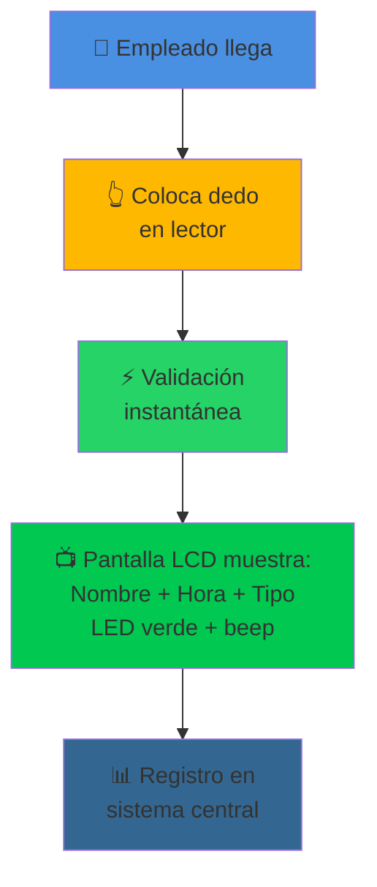
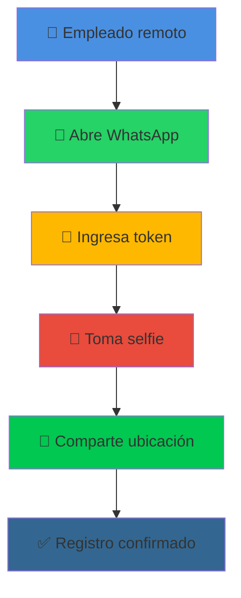
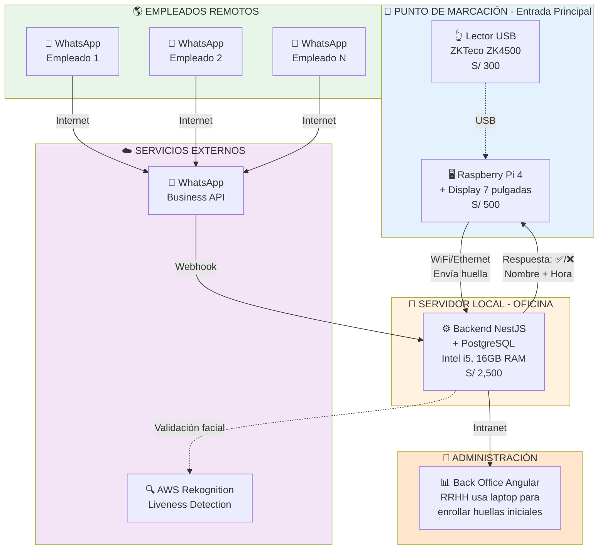
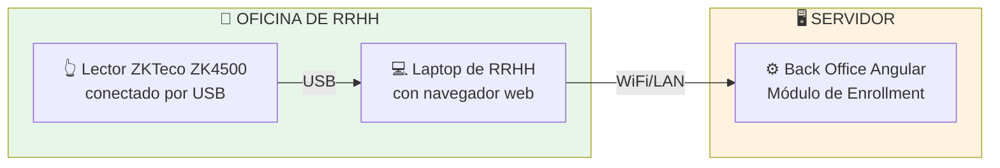
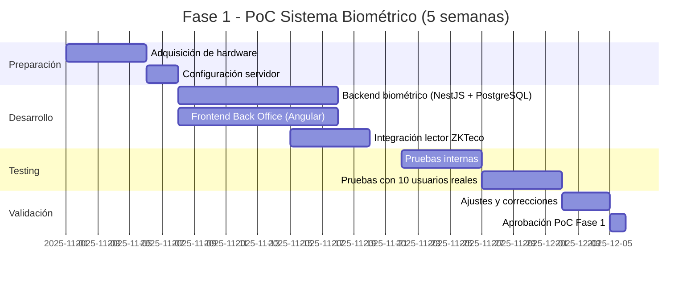
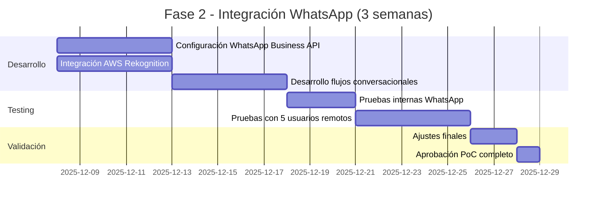
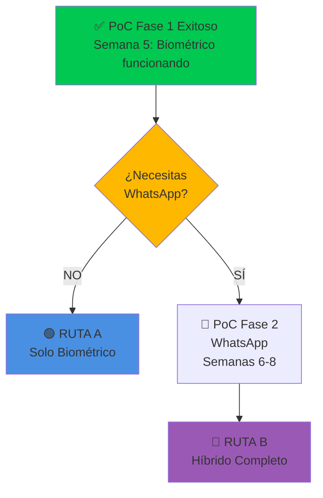
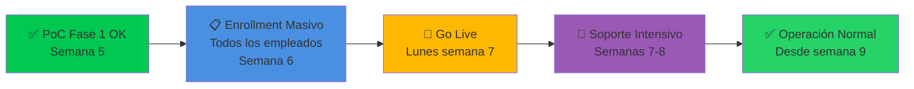
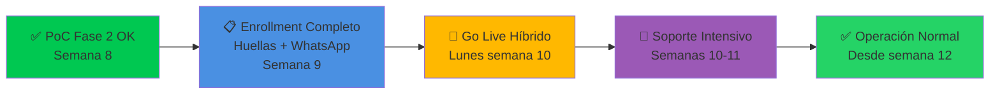

# 🔵 PROPUESTA A: SOLUCIÓN HÍBRIDA
## Biométrico On-site + WhatsApp Remoto

---

<div align="center">


</div>

---

## 🎯 CONCEPTO DE LA SOLUCIÓN

<table>
<tr>
<td width="50%" valign="top">

### 💼 Para Empleados On-site

<div align="center">



</div>

**Tiempo total: < 3 segundos**

#### 📺 Feedback Visual en Pantalla LCD:
- 👤 **Nombre del empleado** reconocido
- ⏰ **Hora exacta** del registro (08:15 AM)
- 🚪 **Tipo de marcación** (ENTRADA / SALIDA)
- ✅ LED verde + sonido confirmación exitosa
- ❌ LED rojo + mensaje si huella no reconocida

✅ Sin necesidad de smartphone
✅ Verificación biométrica real
✅ Imposible suplantación de identidad

</td>
<td width="50%" valign="top">

### 🌎 Para Empleados Remotos

<div align="center">



</div>

**Tiempo total: ~20 segundos**

✅ Desde cualquier lugar
✅ Validación facial + ubicación
✅ Sin apps adicionales (usa WhatsApp)

</td>
</tr>
</table>

---

## 💡 PROPUESTA DE VALOR

<div align="center">

### ¿Por qué es la mejor opción balanceada?

</div>

<table>
<tr>
<td width="33%" align="center" valign="top">

### 🎯
**VERSATILIDAD**

Un solo sistema para dos realidades:
- Oficina física
- Trabajo remoto
- Horarios rotativos

</td>
<td width="33%" align="center" valign="top">

### 💰
**COSTO-BENEFICIO**

Inversión moderada con máximo impacto:
- Hardware accesible
- Sin dependencia de proveedores
- Escalable según crecimiento

</td>
<td width="33%" align="center" valign="top">

### 🔒
**SEGURIDAD**

Doble capa de protección:
- Biometría física en oficina
- 5 validaciones para remotos
- Cumplimiento SUNAFIL total

</td>
</tr>
</table>

---

## 🏗️ ARQUITECTURA DE LA SOLUCIÓN

<div align="center">



</div>

### 🔄 Flujo de Validación On-site

**Cuando un empleado marca:**

1. 👆 **Empleado coloca dedo** en lector USB (ZKTeco ZK4500)
2. 🖥️ **Raspberry Pi captura** la imagen de la huella vía USB
3. 📡 **Raspberry envía** huella al servidor central por WiFi/Ethernet
4. ⚙️ **Servidor valida** contra PostgreSQL (busca coincidencia)
5. ✅ **Servidor responde** al Raspberry: "✅ Juan Pérez - ENTRADA - 08:15 AM"
6. 📺 **Pantalla muestra** mensaje de confirmación al empleado
7. 🔔 **Beep sonoro** de confirmación

**Tiempo total:** < 3 segundos

---

### 🆕 PROCESO DE REGISTRO (ENROLLMENT) DE EMPLEADOS

#### ¿Cómo se inscriben las huellas de los empleados en el sistema?

**✅ La forma más económica - SIN EQUIPO ADICIONAL:**

Usamos el **mismo lector ZKTeco ZK4500** que ya compramos para el punto de marcación. El proceso es simple:

<div align="center">



</div>

#### 📋 Pasos para Inscribir un Nuevo Empleado

<table>
<thead>
<tr>
<th width="10%">Paso</th>
<th width="50%">Acción</th>
<th width="40%">Detalles</th>
</tr>
</thead>
<tbody>

<tr>
<td align="center">1️⃣</td>
<td><strong>RRHH conecta lector a su laptop</strong></td>
<td>
• Desconecta temporalmente el lector del Raspberry Pi<br/>
• Lo conecta por USB a su laptop<br/>
• <em>O mejor: compra un 2º lector solo para enrollment (S/ 300 extra, opcional)</em>
</td>
</tr>

<tr>
<td align="center">2️⃣</td>
<td><strong>Abre el Back Office web</strong></td>
<td>
• Ingresa desde navegador a: <code>http://servidor-local/admin</code><br/>
• Login con credenciales de RRHH<br/>
• Va a sección: <strong>"Empleados → Registrar Nuevo"</strong>
</td>
</tr>

<tr>
<td align="center">3️⃣</td>
<td><strong>Llena datos del empleado</strong></td>
<td>
• Nombre completo<br/>
• DNI<br/>
• Área/departamento<br/>
• Horario asignado<br/>
• Foto de perfil (para reconocimiento facial remoto)
</td>
</tr>

<tr>
<td align="center">4️⃣</td>
<td><strong>Captura huellas dactilares</strong></td>
<td>
• Click en botón <strong>"Registrar Huella"</strong><br/>
• Sistema activa el lector USB<br/>
• Empleado coloca dedo índice derecho (3 veces)<br/>
• Luego dedo índice izquierdo (3 veces - backup)<br/>
• Sistema genera template biométrico y lo guarda en PostgreSQL
</td>
</tr>

<tr>
<td align="center">5️⃣</td>
<td><strong>Confirma y guarda</strong></td>
<td>
• Sistema valida que las 3 capturas coincidan<br/>
• Guarda empleado + template de huella en base de datos<br/>
• Asigna token de WhatsApp (para modalidad remota)<br/>
• ✅ <strong>Empleado listo para marcar asistencia</strong>
</td>
</tr>

</tbody>
</table>

#### ⏱️ Tiempo de Enrollment por Empleado

- **Llenar datos:** ~2 minutos
- **Capturar huellas (6 capturas):** ~1 minuto
- **Validación y guardado:** ~30 segundos

**Total:** ~3.5 minutos por empleado

Para 50 empleados: **~3 horas** (puede hacerse en 1 tarde)

#### 💡 Recomendaciones

<table>
<tr>
<td width="50%" valign="top">

### ✅ Opción Económica (S/ 0 extra)

**Usar el mismo lector del punto de marcación:**

- Temporalmente desconectas el lector del Raspberry Pi
- Lo conectas a laptop de RRHH durante enrollment
- Cuando terminas, lo vuelves a conectar al Raspberry Pi

**Ventajas:**
- ✅ Costo cero, ya tienes el lector
- ✅ Mismo sensor para enrollment y marcación (consistencia)

**Desventajas:**
- ❌ Punto de marcación queda inactivo durante enrollment
- ❌ Tienes que desconectar/reconectar cables

</td>
<td width="50%" valign="top">

### ⭐ Opción Recomendada (S/ 300 extra)

**Comprar un 2º lector dedicado para RRHH:**

- Compras otro ZKTeco ZK4500 (S/ 300)
- Queda permanentemente en laptop de RRHH
- Punto de marcación nunca se interrumpe

**Ventajas:**
- ✅ Enrollment sin interrumpir operación
- ✅ RRHH puede re-enrollar empleados cuando necesite
- ✅ No hay que mover cables
- ✅ Más cómodo para actualizaciones masivas

**Recomendación:** Si tienes más de 30 empleados, vale la pena la inversión

</td>
</tr>
</table>

#### 🔐 Seguridad del Proceso

**¿Cómo evitamos que alguien manipule el enrollment?**

1. **🔒 Autenticación:** Solo usuarios con rol "RRHH" pueden acceder al módulo de enrollment
2. **📝 Auditoría:** Cada enrollment queda registrado con timestamp + usuario que lo realizó
3. **🖼️ Foto obligatoria:** Se exige foto del empleado (para validación facial en remoto)
4. **🔢 DNI único:** No se puede registrar dos veces el mismo DNI
5. **👆 Múltiples capturas:** Se requieren 3 capturas del mismo dedo para validar consistencia
6. **📊 Logs inmutables:** PostgreSQL registra quién, cuándo y desde dónde se hizo el enrollment

---

### 📦 Componentes del Sistema

<table>
<thead>
<tr>
<th width="25%">Componente</th>
<th width="50%">Descripción</th>
<th width="25%">Beneficio Clave</th>
</tr>
</thead>
<tbody>
<tr>
<td>👆 <strong>Lector de Huella USB</strong></td>
<td>Sensor biométrico simple (ZKTeco ZK4500) sin base de datos interna. Solo captura la huella y la envía vía USB al Raspberry Pi</td>
<td><strong>Económico</strong> (S/ 300) y reemplazable</td>
</tr>
<tr>
<td>🖥️ <strong>Raspberry Pi 4 + Display</strong></td>
<td>Mini computadora con pantalla táctil 7". Ejecuta app web en modo kiosk que: (1) recibe huella del lector USB, (2) envía al servidor, (3) muestra resultado en pantalla</td>
<td><strong>Personalizable</strong> y actualizable remotamente</td>
</tr>
<tr>
<td>⚙️ <strong>Servidor Local Central</strong></td>
<td>Servidor físico en oficina (Intel i5, 16GB RAM, 512GB SSD) con NestJS + PostgreSQL. Toda la lógica de validación y DB de empleados está aquí</td>
<td><strong>Control total</strong>, datos en Perú</td>
</tr>
<tr>
<td>💬 <strong>WhatsApp Business</strong></td>
<td>Canal oficial de Meta para empleados remotos con flujos interactivos</td>
<td><strong>Familiar</strong> para usuarios</td>
</tr>
<tr>
<td>🔍 <strong>AWS Rekognition</strong></td>
<td>Servicio cloud para validación facial (liveness detection) de empleados remotos</td>
<td>Evita fraude con <strong>fotos</strong></td>
</tr>
<tr>
<td>📊 <strong>Back Office Angular</strong></td>
<td>Panel web administrativo accesible desde intranet</td>
<td>Visibilidad <strong>tiempo real</strong></td>
</tr>
<tr>
<td>🗄️ <strong>PostgreSQL</strong></td>
<td>Base de datos local con registros inmutables y firma digital SHA-256</td>
<td><strong>Garantía legal</strong> SUNAFIL</td>
</tr>
</tbody>
</table>

### ⚡ Ventajas de esta Arquitectura

**vs Propuesta B (Terminales inteligentes):**
- ✅ **S/ 3,820 más económico** (S/ 3,980 vs S/ 7,800)
- ✅ **Pantalla personalizable** - Puedes cambiar colores, textos, logos sin depender del fabricante
- ✅ **Actualizaciones remotas** - Software se actualiza sin tocar hardware
- ✅ **Componentes reemplazables** - Si falla algo, cambias solo esa parte
- ✅ **Sin vendor lock-in** - No dependes de un fabricante específico

**Desventajas vs Propuesta B:**
- ❌ **Requiere conexión red** - No funciona offline
- ❌ **Instalación más compleja** - Varios componentes por punto
- ❌ **Sin certificación ISO** - No tiene sello del fabricante (pero cumple SUNAFIL igual)

---

## 🔐 VALIDACIONES DE SEGURIDAD

### Para Empleados On-site (Biométrico)

<div align="center">

| # | Validación | Objetivo |
|:-:|------------|----------|
| 1️⃣ | **Huella dactilar** | Identificación biométrica real |
| 2️⃣ | **Usuario registrado** | Verificar que esté en base de datos |
| 3️⃣ | **Horario permitido** | Validar que esté dentro de su turno |
| 4️⃣ | **No duplicado** | Evitar múltiples marcaciones en < 15 min |
| 5️⃣ | **Firma digital** | Registro con hash SHA-256 inmutable |

</div>

### Para Empleados Remotos (WhatsApp)

<div align="center">

| # | Validación | Objetivo |
|:-:|------------|----------|
| 1️⃣ | **Token personal** | Código de 6 dígitos rotatorio (cambia cada 3 meses) |
| 2️⃣ | **Liveness detection** | Verificar que es una persona viva (no foto estática) |
| 3️⃣ | **Facial matching** | Comparar selfie con foto de perfil (> 90% similitud) |
| 4️⃣ | **Device fingerprint** | Validar que es el mismo dispositivo autorizado |
| 5️⃣ | **Geolocalización** | Verificar que está en zona permitida (radio 500m) |
| 6️⃣ | **Horario permitido** | Validar turno asignado |
| 7️⃣ | **No duplicado** | Evitar doble marcación |
| 8️⃣ | **Firma digital** | Registro inmutable |

</div>

---

## 💰 INVERSIÓN Y COSTOS

### Desglose Financiero

<table>
<thead>
<tr>
<th width="40%">Concepto</th>
<th width="15%" align="center">Cantidad</th>
<th width="20%" align="right">Precio Unit.</th>
<th width="25%" align="right">Subtotal</th>
</tr>
</thead>
<tbody>

<tr style="background-color: #E3F2FD;">
<td colspan="4"><strong>💰 INVERSIÓN INICIAL (Una sola vez)</strong></td>
</tr>

<tr>
<td>👆 <strong>Lector de Huella Simple</strong> (ZKTeco ZK4500 USB)<br/><sub>Sin DB interna, solo sensor - También usado para enrollment</sub></td>
<td align="center">1</td>
<td align="right">S/ 300</td>
<td align="right"><strong>S/ 300</strong></td>
</tr>

<tr>
<td>🖥️ <strong>Raspberry Pi 4 + Display 7"</strong><br/><sub>Mini computadora + pantalla táctil para punto de marcación</sub></td>
<td align="center">1</td>
<td align="right">S/ 500</td>
<td align="right"><strong>S/ 500</strong></td>
</tr>

<tr>
<td>📦 <strong>Carcasa y soporte de pared</strong></td>
<td align="center">1</td>
<td align="right">S/ 80</td>
<td align="right"><strong>S/ 80</strong></td>
</tr>

<tr>
<td>🔌 <strong>Cables y accesorios</strong><br/><sub>USB, HDMI, power supplies</sub></td>
<td align="center">1</td>
<td align="right">S/ 50</td>
<td align="right"><strong>S/ 50</strong></td>
</tr>

<tr>
<td>🔌 Switch de red (8 puertos)</td>
<td align="center">1</td>
<td align="right">S/ 150</td>
<td align="right"><strong>S/ 150</strong></td>
</tr>

<tr>
<td>🖥️ <strong>Servidor Local Físico</strong><br/><sub>Mini PC / Torre: Intel i5, 16GB RAM, 512GB SSD</sub></td>
<td align="center">1</td>
<td align="right">S/ 2,500</td>
<td align="right"><strong>S/ 2,500</strong></td>
</tr>

<tr>
<td>🔧 Instalación y configuración</td>
<td align="center">-</td>
<td align="right">-</td>
<td align="right"><strong>S/ 400</strong></td>
</tr>

<tr style="background-color: #f9f9f9; font-weight: bold;">
<td colspan="3"><strong>TOTAL INVERSIÓN INICIAL</strong></td>
<td align="right"><strong>S/ 3,980</strong></td>
</tr>

<tr><td colspan="4">&nbsp;</td></tr>

<tr style="background-color: #FFF3E0;">
<td colspan="4"><strong>📅 COSTOS OPERATIVOS MENSUALES</strong></td>
</tr>

<tr>
<td>⚡ Electricidad servidor local<br/><sub>Consumo aprox. 100W 24/7</sub></td>
<td align="center">1</td>
<td align="right">S/ 50/mes</td>
<td align="right"><strong>S/ 50</strong></td>
</tr>

<tr>
<td>💬 WhatsApp Business API<br/><sub>Conversaciones iniciadas por usuario = GRATIS<br/>Solo se cobra si envías recordatorios automáticos</sub></td>
<td align="center">1</td>
<td align="right">S/ 0/mes</td>
<td align="right"><strong>S/ 0</strong></td>
</tr>

<tr>
<td>🔍 Liveness detection (AWS Rekognition)<br/><sub>~1,000 validaciones/mes</sub></td>
<td align="center">-</td>
<td align="right">S/ 0.0037/validación</td>
<td align="right"><strong>S/ 75</strong></td>
</tr>

<tr>
<td>💾 Backups (disco duro externo)</td>
<td align="center">1</td>
<td align="right">S/ 37.50/mes</td>
<td align="right"><strong>S/ 37.50</strong></td>
</tr>

<tr style="background-color: #f9f9f9; font-weight: bold;">
<td colspan="3"><strong>TOTAL MENSUAL (sin recordatorios)</strong></td>
<td align="right"><strong>S/ 162.50/mes</strong></td>
</tr>

<tr style="background-color: #f9f9f9; font-weight: bold;">
<td colspan="3"><strong>TOTAL ANUAL</strong></td>
<td align="right"><strong>S/ 1,950/año</strong></td>
</tr>

<tr><td colspan="4">&nbsp;</td></tr>

<tr style="background-color: #E8F5E9;">
<td colspan="4"><strong>💡 OPCIÓN CON RECORDATORIOS AUTOMÁTICOS (Opcional)</strong></td>
</tr>

<tr>
<td>💬 WhatsApp - Recordatorios proactivos<br/><sub>Solo empleados remotos, ~220 mensajes/mes</sub></td>
<td align="center">Opcional</td>
<td align="right">S/ 44/mes</td>
<td align="right"><strong>+ S/ 44</strong></td>
</tr>

<tr style="background-color: #f9f9f9; font-weight: bold;">
<td colspan="3"><strong>TOTAL MENSUAL (con recordatorios)</strong></td>
<td align="right"><strong>S/ 206.50/mes</strong></td>
</tr>

</tbody>
</table>

### 📊 Proyección a 3 Años

<div align="center">

**Escenario Base (Sin recordatorios automáticos):**

| Año | Inversión | Operativo | Acumulado |
|:---:|----------:|----------:|----------:|
| **0** | S/ 3,980 | - | S/ 3,980 |
| **1** | - | S/ 1,950 | S/ 5,930 |
| **2** | - | S/ 1,950 | S/ 7,880 |
| **3** | - | S/ 1,950 | **S/ 9,830** |

**Costo mensual promedio: S/ 162.50/mes**

---

**Escenario con Recordatorios (Opcional):**

| Año | Inversión | Operativo | Acumulado |
|:---:|----------:|----------:|----------:|
| **0** | S/ 3,980 | - | S/ 3,980 |
| **1** | - | S/ 2,478 | S/ 6,458 |
| **2** | - | S/ 2,478 | S/ 8,936 |
| **3** | - | S/ 2,478 | **S/ 11,414** |

**Costo mensual promedio: S/ 206.50/mes**

</div>

---

## ✅ VENTAJAS COMPETITIVAS

<table>
<tr>
<td width="50%" valign="top">

### ✨ Fortalezas

1. **🎯 Balance óptimo** entre costo y seguridad
2. **🔐 Biometría física** en oficina (máxima seguridad)
3. **📱 Flexibilidad remota** con WhatsApp (comodidad)
4. **💰 Inversión económica** (S/ 3,980 inicial - solo 1 punto)
5. **🖥️ Servidor local** (control total, datos en Perú)
6. **🔧 Sin dependencia** de proveedores cloud
7. **📈 Escalable** (agregar puntos por solo S/ 930 c/u)
8. **✅ Cumplimiento SUNAFIL** garantizado
9. **⚡ Implementación flexible** (5-8 semanas según necesidades)

</td>
<td width="50%" valign="top">

### ⚠️ Consideraciones

1. **🔌 Requiere instalación** de hardware en oficina
2. **🔧 Mantenimiento moderado** de lectores biométricos
3. **📡 Dependencia de conectividad** WiFi/Ethernet
4. **👥 Capacitación necesaria** para administradores
5. **⏳ Tiempo de implementación** mayor que Propuesta C
6. **🔄 Actualizaciones** de firmware de lectores

</td>
</tr>
</table>

---

## 🎬 CASOS DE USO

### Escenario 1: Empresa con Oficina Central y Remotos

<table>
<tr>
<td width="50%" valign="top">

#### 📍 Contexto

- 30 empleados en oficina
- 15 empleados remotos
- Horarios rotativos (mañana/tarde)
- Necesidad de cumplimiento SUNAFIL

</td>
<td width="50%" valign="top">

#### ✅ Solución

- 1 lector biométrico en entrada principal
- Todos los empleados con acceso WhatsApp
- Dashboard para RRHH con visibilidad total
- Reportes automáticos mensuales
- *Opcionalmente: 1 lector extra para RRHH (enrollment)*

</td>
</tr>
</table>

**Resultado esperado:**
- ⏱️ Tiempo de marcación on-site: < 3 seg
- ⏱️ Tiempo de marcación remota: < 25 seg
- ✅ 100% cumplimiento normativo
- 📊 Reportes en 5 minutos vs 15 horas antes

---

### Escenario 2: Empresa con Múltiples Turnos

<table>
<tr>
<td width="50%" valign="top">

#### 📍 Contexto

- 50 empleados en 3 turnos (mañana, tarde, noche)
- Personal de seguridad 24/7
- Alta rotación de personal
- Auditorías frecuentes de SUNAFIL

</td>
<td width="50%" valign="top">

#### ✅ Solución

- 1 lector biométrico en entrada principal (escalable a más puntos)
- Configuración de horarios rotativos en sistema
- Alertas automáticas de ausencias
- Modalidad WhatsApp para personal en campo

</td>
</tr>
</table>

**Resultado esperado:**
- 🔒 Cero suplantaciones de identidad
- 📋 Trazabilidad completa para auditorías
- ⏰ Gestión automatizada de turnos rotativos
- 💾 Continuidad operativa con buffer offline

---

## 📊 PLAN DE IMPLEMENTACIÓN (PoC)

### Estrategia: Implementación por Fases

**🎯 Primero:** Sistema biométrico (core del negocio)
**🎯 Después:** Integración WhatsApp (funcionalidad adicional)

---

### 📍 FASE 1: PoC SISTEMA BIOMÉTRICO (5 semanas)

**Objetivo:** Validar que el sistema físico funciona perfectamente antes de agregar complejidad

<div align="center">



</div>

#### Entregables Fase 1 (Solo Biométrico)

<table>
<thead>
<tr>
<th width="30%">Entregable</th>
<th width="50%">Descripción</th>
<th width="20%">Semana</th>
</tr>
</thead>
<tbody>
<tr>
<td>🔐 <strong>Punto de Marcación Instalado</strong></td>
<td>Lector ZKTeco + Raspberry Pi + Display funcionando</td>
<td align="center">1</td>
</tr>
<tr>
<td>🖥️ <strong>Servidor Configurado</strong></td>
<td>NestJS + PostgreSQL en servidor local</td>
<td align="center">2</td>
</tr>
<tr>
<td>⚙️ <strong>Backend Biométrico</strong></td>
<td>API REST para validación de huellas + registro de marcaciones</td>
<td align="center">3</td>
</tr>
<tr>
<td>📊 <strong>Back Office Web</strong></td>
<td>Panel Angular con: enrollment, gestión empleados, reportes, dashboard tiempo real</td>
<td align="center">3</td>
</tr>
<tr>
<td>👥 <strong>Testing con Usuarios</strong></td>
<td>10 empleados on-site probando el sistema durante 1 semana</td>
<td align="center">4</td>
</tr>
<tr>
<td>📈 <strong>Reporte de Resultados</strong></td>
<td>KPIs, métricas de rendimiento y recomendaciones</td>
<td align="center">5</td>
</tr>
</tbody>
</table>

#### Criterios de Éxito Fase 1

<div align="center">

| KPI | Objetivo | Medición |
|-----|----------|----------|
| ⏱️ **Tiempo de marcación** | < 3 seg | Promedio de 100 registros |
| 🎯 **Tasa de éxito biométrico** | > 99% | Lecturas exitosas / total intentos |
| 🔒 **Cero suplantaciones** | 100% | Intentos de fraude bloqueados |
| 👥 **Satisfacción de usuarios** | > 4/5 ⭐ | Encuesta post-testing |
| ✅ **Disponibilidad del sistema** | > 99.5% | Uptime durante semana de pruebas |
| 📊 **Generación de reportes** | < 5 min | Reporte SUNAFIL mensual completo |

</div>

---

### 📱 FASE 2: INTEGRACIÓN WHATSAPP (3 semanas)

**Requisito previo:** ✅ Fase 1 aprobada y funcionando

<div align="center">



</div>

#### Entregables Fase 2 (WhatsApp)

<table>
<thead>
<tr>
<th width="30%">Entregable</th>
<th width="50%">Descripción</th>
<th width="20%">Semana</th>
</tr>
</thead>
<tbody>
<tr>
<td>💬 <strong>WhatsApp Business Activo</strong></td>
<td>Cuenta oficial Meta verificada y configurada</td>
<td align="center">1</td>
</tr>
<tr>
<td>🔍 <strong>AWS Rekognition Integrado</strong></td>
<td>Liveness detection + facial matching funcionando</td>
<td align="center">1</td>
</tr>
<tr>
<td>🤖 <strong>Flujos Conversacionales</strong></td>
<td>Chatbot para marcación entrada/salida con validaciones</td>
<td align="center">2</td>
</tr>
<tr>
<td>👥 <strong>Testing Remoto</strong></td>
<td>5 empleados remotos probando marcación por WhatsApp</td>
<td align="center">2</td>
</tr>
<tr>
<td>📈 <strong>Reporte Final PoC</strong></td>
<td>Sistema completo (biométrico + WhatsApp) validado</td>
<td align="center">3</td>
</tr>
</tbody>
</table>

#### Criterios de Éxito Fase 2

<div align="center">

| KPI | Objetivo | Medición |
|-----|----------|----------|
| ⏱️ **Tiempo de marcación WhatsApp** | < 30 seg | Promedio de 50 registros |
| 🎯 **Tasa de completación flujo** | > 95% | Flujos completados / iniciados |
| 🔒 **Detección de fotos estáticas** | 100% | Liveness detection rechazando fotos |
| 📍 **Validación de ubicación** | > 98% | Empleados dentro de zona permitida |
| 👥 **Satisfacción usuarios remotos** | > 4/5 ⭐ | Encuesta post-testing |

</div>

---

### ✅ Ventajas de Implementar por Fases

<table>
<tr>
<td width="50%" valign="top">

#### 🎯 Por qué Primero el Biométrico

1. **Es el core del negocio** - La mayoría de empleados están on-site
2. **Validación más simple** - Solo 1 componente de hardware
3. **Menos dependencias** - No requiere servicios externos (WhatsApp, AWS)
4. **Cumplimiento SUNAFIL inmediato** - Con solo el biométrico ya cumples
5. **Menor costo inicial** - Puedes arrancar sin pagar WhatsApp Business API
6. **Base sólida** - Backend y DB ya probados antes de agregar WhatsApp

</td>
<td width="50%" valign="top">

#### 📱 Por qué WhatsApp Después

1. **Funcionalidad adicional** - No todos tienen empleados remotos
2. **Mayor complejidad técnica** - Webhooks, AWS, validaciones múltiples
3. **Dependencia de terceros** - Meta, AWS (pueden fallar)
4. **Costos recurrentes** - S/ 262.50/mes (puedes diferir el gasto)
5. **Requiere más testing** - Liveness detection, geolocalización, etc.
6. **Opcional para algunas empresas** - Si no hay remotos, se puede omitir

</td>
</tr>
</table>

---

### 📊 Timeline Completo

| Semana | Fase | Actividad |
|:------:|------|-----------|
| 1-2 | **Fase 1** | Instalación hardware + desarrollo backend/frontend |
| 3 | **Fase 1** | Integración lector + testing interno |
| 4 | **Fase 1** | Pruebas con 10 usuarios reales |
| 5 | **Fase 1** | Ajustes + aprobación PoC biométrico |
| 6-7 | **Fase 2** | Desarrollo e integración WhatsApp + AWS |
| 8 | **Fase 2** | Testing con usuarios remotos + aprobación final |

**Duración total PoC completo:** 8 semanas
**Duración PoC solo biométrico:** 5 semanas (si no necesitas WhatsApp)

---

## 🚀 PUESTA EN PRODUCCIÓN

### Dos Rutas Posibles

Después del PoC por fases, tienes **2 opciones** según tus necesidades:

<div align="center">



</div>

---

### 🟢 RUTA A: PRODUCCIÓN SOLO BIOMÉTRICO

**Ideal si:** Solo tienes empleados on-site o no necesitas validación remota todavía

<div align="center">



</div>

#### Semana 6: Enrollment Masivo (Solo Huellas)
- **RRHH enrolla a TODOS los empleados on-site**
- Registro de huellas con el lector ZKTeco
- Carga de datos básicos (nombre, DNI, horario)
- **NO se configura WhatsApp todavía**
- **Tiempo estimado:** 3 min/empleado × 50 empleados = **~2.5 horas**

#### Semana 7: Go Live Biométrico (Lunes)
- **Sistema entra en producción** desde el lunes
- Capacitación express (15 min) a empleados on-site:
  - Cómo colocar el dedo en el lector
  - Qué hacer si la huella no se reconoce
  - Cómo ver sus propios registros
- RRHH monitorea en tiempo real desde Back Office
- Soporte técnico on-site todo el día

#### Semanas 7-8: Soporte Intensivo
- Soporte on-site las primeras 2 semanas
- Resolución inmediata de problemas
- Re-enrollment si hay dedos con problemas
- Ajustes de configuración según feedback

#### Desde Semana 9: Operación Normal
- Sistema 100% autónomo
- Soporte remoto (email/teléfono)
- Monitoreo mensual de KPIs

**💰 Costo mensual Ruta A:** **S/ 87.50** (solo servidor + backups, sin WhatsApp ni AWS)

---

### 🔵 RUTA B: PRODUCCIÓN HÍBRIDA COMPLETA

**Ideal si:** Tienes empleados remotos o de campo que necesitan marcar por WhatsApp

<div align="center">



</div>

#### Semana 9: Enrollment Completo (Huellas + WhatsApp)
- **RRHH enrolla a TODOS los empleados** (on-site + remotos)
- Empleados on-site: Huellas (como en Ruta A)
- Empleados remotos: Huellas + foto de perfil + token WhatsApp + zona GPS permitida
- **Tiempo estimado:**
  - On-site: 3 min/empleado
  - Remotos: 5 min/empleado (foto + configuración WhatsApp)
  - Ejemplo: 40 on-site + 10 remotos = **~3 horas**

#### Semana 10: Go Live Híbrido (Lunes)
- **Sistema completo entra en producción**
- Capacitación diferenciada:
  - **Empleados on-site (15 min):** Uso del lector biométrico
  - **Empleados remotos (30 min):** Flujo completo WhatsApp (token + selfie + ubicación)
- RRHH monitorea ambos canales en tiempo real
- Soporte on-site para biométrico + soporte remoto para WhatsApp

#### Semanas 10-11: Soporte Intensivo
- Soporte on-site para lector biométrico
- Soporte por WhatsApp para empleados remotos
- Resolución de problemas de liveness detection
- Ajuste de zonas GPS permitidas
- Re-enrollment si es necesario

#### Desde Semana 12: Operación Normal
- Sistema híbrido 100% autónomo
- Monitoreo de KPIs de ambos canales
- Soporte remoto continuo

**💰 Costo mensual Ruta B:** **S/ 350** (servidor + WhatsApp Business + AWS Rekognition + backups)

---

### 📊 Comparación de Rutas

<table>
<thead>
<tr>
<th width="30%">Aspecto</th>
<th width="35%">🟢 Ruta A (Solo Biométrico)</th>
<th width="35%">🔵 Ruta B (Híbrido)</th>
</tr>
</thead>
<tbody>
<tr>
<td><strong>Duración PoC</strong></td>
<td>5 semanas</td>
<td>8 semanas</td>
</tr>
<tr>
<td><strong>Go Live</strong></td>
<td>Semana 7</td>
<td>Semana 10</td>
</tr>
<tr>
<td><strong>Inversión Inicial</strong></td>
<td>S/ 3,980</td>
<td>S/ 3,980 (mismo hardware)</td>
</tr>
<tr>
<td><strong>Costo Mensual</strong></td>
<td>S/ 87.50</td>
<td>S/ 350</td>
</tr>
<tr>
<td><strong>Costo Año 1</strong></td>
<td>S/ 5,030</td>
<td>S/ 8,180</td>
</tr>
<tr>
<td><strong>Para quién</strong></td>
<td>100% empleados on-site</td>
<td>Empleados on-site + remotos</td>
</tr>
<tr>
<td><strong>Complejidad</strong></td>
<td>Baja</td>
<td>Media</td>
</tr>
<tr>
<td><strong>Dependencias</strong></td>
<td>Ninguna (todo local)</td>
<td>WhatsApp API + AWS</td>
</tr>
<tr>
<td><strong>¿Se puede migrar?</strong></td>
<td>✅ Sí, de A → B en cualquier momento</td>
<td>✅ Sí, de B → A (desactivar WhatsApp)</td>
</tr>
</tbody>
</table>

---

### 💡 Recomendación

**¿Cuál ruta elegir?**

1. **Si NO tienes empleados remotos hoy:**
   - ✅ Empieza con **Ruta A** (solo biométrico)
   - ✅ Ahorra S/ 262.50/mes en costos operativos
   - ✅ Puedes migrar a Ruta B después cuando necesites WhatsApp
   - ✅ Go Live más rápido (semana 7 vs semana 10)

2. **Si YA tienes empleados remotos:**
   - ✅ Implementa **Ruta B** completa desde el inicio
   - ✅ Solución integral para toda la empresa
   - ✅ Un solo sistema para todos

3. **Si NO estás seguro:**
   - ✅ Empieza con **Ruta A**
   - ✅ Valida el biométrico primero (core del negocio)
   - ✅ Agrega WhatsApp después si realmente lo necesitas

---

### 🔄 Migración de Ruta A → Ruta B

Si empiezas con solo biométrico y luego necesitas WhatsApp:

<div align="center">


</div>

**Ventaja:** Los empleados on-site NO se ven afectados, siguen usando el biométrico normalmente


## 🛒 EQUIPOS RECOMENDADOS Y PROVEEDORES

### Arquitectura de Hardware - Propuesta A

Esta propuesta usa **lectores de huella SIMPLES** (sin base de datos interna) + **servidor central** + **pantallas de feedback**.

```
[Lector Simple] --TCP/IP--> [Servidor Central] ---> [Pantalla Feedback]
                              con PostgreSQL
```

**Diferencia clave con Propuesta B:**
- ✅ Propuesta A: Lector "tonto" sin DB, servidor valida todo, más económico
- ✅ Propuesta B: Terminal "inteligente" con DB interna, funciona offline, más caro

---

### 1️⃣ Lectores de Huella (Sin DB Interna)

<table>
<thead>
<tr>
<th width="20%">Marca/Modelo</th>
<th width="35%">Características</th>
<th width="20%">Precio Referencial</th>
<th width="25%">Dónde Comprar</th>
</tr>
</thead>
<tbody>

<tr>
<td><strong>🥇 ZKTeco ZK4500</strong><br/>(Recomendado)</td>
<td>
• <strong>Solo sensor de huella</strong> (sin pantalla ni DB)<br/>
• Sensor óptico FBI-certified<br/>
• Conexión: USB 2.0<br/>
• SDK gratuito para integración<br/>
• Resolución: 500 DPI<br/>
• Ideal para conectar a servidor
</td>
<td align="center"><strong>S/ 250 - S/ 350</strong></td>
<td>
• <strong>Mercado Libre Perú</strong><br/>
• <strong>Amazon (importación)</strong><br/>
• <strong>Av. Wilson</strong> - Centro Lima<br/>
• Distribuidores biométricos
</td>
</tr>

<tr>
<td><strong>🥈 Digital Persona U.are.U 4500</strong></td>
<td>
• Sensor de huella USB<br/>
• Sin DB interna (solo lector)<br/>
• SDK profesional incluido<br/>
• Resolución: 512 DPI<br/>
• Ampliamente usado en embajadas
</td>
<td align="center"><strong>S/ 400 - S/ 550</strong></td>
<td>
• <strong>Distribuidores corporativos</strong><br/>
• <strong>Mercado Libre</strong><br/>
• Importadores San Isidro<br/>
• Online: eBay + courier
</td>
</tr>

<tr>
<td><strong>🥉 Suprema BioMini Plus 2</strong></td>
<td>
• Sensor compacto USB<br/>
• Sin pantalla ni memoria<br/>
• SDK gratuito<br/>
• Certificado FBI PIV<br/>
• Alta precisión
</td>
<td align="center"><strong>S/ 300 - S/ 450</strong></td>
<td>
• <strong>Importadores especializados</strong><br/>
• Tiendas de seguridad<br/>
• Mercado Libre (verificar)
</td>
</tr>

<tr>
<td><strong>ZKTeco SLK20R</strong><br/>(Ethernet)</td>
<td>
• Lector con <strong>conexión Ethernet</strong><br/>
• Sin DB ni pantalla integrada<br/>
• Se conecta directo a red local<br/>
• SDK incluido<br/>
• Ideal para instalación remota
</td>
<td align="center"><strong>S/ 450 - S/ 600</strong></td>
<td>
• <strong>Distribuidores ZKTeco</strong><br/>
• Mercado Libre Perú<br/>
• Av. Wilson - Lima Centro
</td>
</tr>

</tbody>
</table>

### 2️⃣ Pantallas de Feedback (Display Externo)

<table>
<thead>
<tr>
<th width="25%">Opción</th>
<th width="40%">Descripción</th>
<th width="15%">Precio</th>
<th width="20%">Ventajas</th>
</tr>
</thead>
<tbody>

<tr>
<td><strong>🥇 Raspberry Pi 4 + Display 7"</strong><br/>(Recomendado)</td>
<td>
• Raspberry Pi 4 (4GB RAM)<br/>
• Pantalla táctil oficial 7"<br/>
• Carcasa con soporte de pared<br/>
• Ejecuta app web (navegador kiosk)<br/>
• Se conecta al servidor vía WiFi/Ethernet<br/>
• Modo bloqueado (no manipulable)
</td>
<td align="center"><strong>S/ 450 - S/ 600</strong></td>
<td>
✅ Personalizable<br/>
✅ Bajo consumo<br/>
✅ Fácil actualización<br/>
✅ Anti-manipulación
</td>
</tr>

<tr>
<td><strong>🥈 Monitor LED 15.6" + Mini PC</strong></td>
<td>
• Monitor compacto 15.6"<br/>
• Mini PC (Celeron, 4GB RAM)<br/>
• Navegador en modo kiosk<br/>
• Montaje VESA en pared<br/>
• Teclado/mouse deshabilitados
</td>
<td align="center"><strong>S/ 700 - S/ 900</strong></td>
<td>
✅ Pantalla grande<br/>
✅ Más visible<br/>
✅ Windows/Linux
</td>
</tr>

<tr>
<td><strong>🥉 Tablet Android 10" en modo kiosk</strong></td>
<td>
• Tablet Android económica<br/>
• App kiosk (bloqueada)<br/>
• Soporte de pared<br/>
• WiFi para conectar al servidor<br/>
• Cargador permanente
</td>
<td align="center"><strong>S/ 300 - S/ 450</strong></td>
<td>
✅ Más económico<br/>
✅ Táctil<br/>
✅ Fácil instalación
</td>
</tr>

</tbody>
</table>

### 🔧 Arquitectura Técnica Detallada

```
┌─────────────────────────────────────────────────────┐
│         🏢 PUNTO DE MARCACIÓN (Por entrada)         │
├─────────────────────────────────────────────────────┤
│                                                     │
│  [👆 Lector Huella]  <--USB/Ethernet-->  [Raspberry Pi 4]
│   ZKTeco ZK4500                          + Display 7"
│   S/ 300                                 S/ 500
│                                                     │
│   El Raspberry Pi:                                 │
│   1. Recibe huella del lector                      │
│   2. La envía al servidor central vía WiFi/LAN     │
│   3. Servidor valida contra PostgreSQL             │
│   4. Servidor responde: ✅/❌                       │
│   5. Raspberry muestra en pantalla:                │
│      "✅ Bienvenido Juan Pérez"                    │
│      "ENTRADA - 08:15 AM"                          │
│                                                     │
└─────────────────────────────────────────────────────┘
         ↓ WiFi/Ethernet (Red Local)
┌─────────────────────────────────────────────────────┐
│      🖥️ SERVIDOR LOCAL (En oficina principal)      │
│   • NestJS + PostgreSQL                            │
│   • Valida huella vs DB de empleados              │
│   • Registra marcación con timestamp              │
│   • Responde a Raspberry Pi con resultado         │
└─────────────────────────────────────────────────────┘
```

### 💡 Recomendación Final - Propuesta A

**Kit completo por punto de marcación:**

| Componente | Modelo | Precio |
|------------|--------|--------|
| 👆 Lector de huella | ZKTeco ZK4500 (USB) | S/ 300 |
| 🖥️ Mini computadora | Raspberry Pi 4 (4GB) | S/ 350 |
| 📺 Pantalla | Display oficial 7" táctil | S/ 150 |
| 📦 Carcasa + montaje | Con soporte pared | S/ 80 |
| 🔌 Cables y accesorios | USB, HDMI, power | S/ 50 |
| **TOTAL POR PUNTO** | | **S/ 930** |

**Para 1 punto de marcación:** S/ 930

*(Si necesitas más puntos, cada uno adicional cuesta S/ 930)*

**Ventajas de esta arquitectura:**
- ✅ **Muy económico** - Solo S/ 930 por punto de marcación (vs S/ 2,000+ de terminales comerciales)
- ✅ **No manipulable** - Raspberry en modo kiosk, sin acceso físico
- ✅ **Centralizado** - Toda la DB en servidor, no distribuida en cada terminal
- ✅ **Flexible** - Pantalla personalizable vía HTML/CSS (colores, logos, mensajes)
- ✅ **Actualizable** - Software se actualiza remotamente sin tocar hardware
- ✅ **Escalable** - Fácil agregar más puntos (solo S/ 930 c/u)
- ✅ **Reparable** - Si falla un componente, lo cambias individualmente

**Desventajas vs Propuesta B:**
- ❌ **No funciona offline** - Requiere conexión permanente al servidor
- ❌ **Instalación más compleja** - Varios componentes por punto (lector + Raspberry + display)
- ❌ **Sin certificación ISO** - No tiene sello del fabricante (pero cumple SUNAFIL igual)
- ❌ **Más componentes** - Mayor probabilidad de fallo de alguna pieza

### 🏪 Dónde Comprar en Perú

<table>
<tr>
<td width="50%" valign="top">

#### 👆 Lectores de Huella

**Mercado Libre Perú**
- Buscar: "ZKTeco ZK4500 lector USB"
- Buscar: "Digital Persona U.are.U"
- Verificar vendedor con buena reputación
- Precio: S/ 250 - S/ 550

**Av. Wilson - Centro Lima**
- Galerías de electrónica
- Importadores de equipos biométricos
- Negociable en efectivo

**Importación Directa**
- Amazon.com + courier (4-7 días)
- AliExpress (15-30 días, más económico)

</td>
<td width="50%" valign="top">

#### 🖥️ Raspberry Pi + Display

**Electronilab** (electronilab.pe)
- Distribuidor oficial Raspberry Pi Perú
- Raspberry Pi 4 (4GB): ~S/ 350
- Display 7" oficial: ~S/ 150
- Envíos a todo Perú

**Naylamp Mechatronics**
- Tienda física en Lima
- Stock completo de componentes
- Soporte técnico

**Mercado Libre / Amazon**
- Múltiples opciones
- Comparar precios

</td>
</tr>
</table>

### 📋 Checklist de Compra

Antes de comprar, verificar:
- ☑️ Lector tiene SDK/API para integración
- ☑️ Compatible con Linux (para Raspberry Pi)
- ☑️ Raspberry Pi 4 (mínimo 2GB RAM, recomendado 4GB)
- ☑️ Display con carcasa protectora
- ☑️ Cables USB de calidad (para evitar desconexiones)
- ☑️ Fuente de alimentación estable
- ☑️ Garantía del vendedor

---

## 💼 CASO DE NEGOCIO

### ROI Estimado

<table>
<tr>
<td width="50%" valign="top">

#### 💰 Ahorros Anuales

| Concepto | Ahorro |
|----------|-------:|
| Reducción tiempo reportes | S/ 12,600 |
| Evitar multas SUNAFIL (riesgo) | S/ 1,875 |
| Reducción errores administrativos | S/ 3,750 |
| **TOTAL ANUAL** | **S/ 18,225** |

</td>
<td width="50%" valign="top">

#### 📊 Retorno de Inversión

```
Inversión Año 1 (sin recordatorios):
  Inicial: S/ 3,980
  Operativo: S/ 1,950
  Total: S/ 5,930

Inversión Año 1:
    Inicial: S/ 3,980
    Operativo: S/ 1,950
    Total: S/ 5,930

Ahorro Año 1 (estimado): S/ 18,225

ROI = (18,225 - 5,930) / 5,930
ROI = 207%

Payback: 3.9 meses
```

</td>
</tr>
</table>

---

## 🎯 IDEAL PARA

<div align="center">

### ✅ Esta propuesta es perfecta si tu organización:

</div>

<table>
<tr>
<td width="50%" valign="top">

- ✅ Tiene **oficina física** con empleados on-site
- ✅ También tiene **trabajadores remotos** o de campo
- ✅ Busca **balance entre costo y seguridad**
- ✅ Requiere **cumplimiento SUNAFIL** garantizado
- ✅ Valora la **flexibilidad** en registro de asistencia
- ✅ Puede invertir **S/ 3,980 iniciales**
- ✅ Prefiere **servidor local** (datos en Perú)
- ✅ Cuenta con **infraestructura de red** básica
- ✅ Prefiere solución **personalizable** y escalable

</td>
<td width="50%" valign="top">

### ❌ NO es ideal si:

- ❌ No tienes oficina física (100% remoto)
- ❌ Presupuesto inicial muy limitado (< S/ 3,000)
- ❌ Necesitas implementación **urgente** (< 4 semanas)
- ❌ No cuentas con soporte TI interno
- ❌ Edificio sin infraestructura de red
- ❌ No tienes espacio para servidor local

</td>
</tr>
</table>

---

<div align="center">

## 📚 DOCUMENTACIÓN RELACIONADA

[](./00-RESUMEN-EJECUTIVO.md)
[](./02-PROPUESTA-B-COMERCIAL.md)
[](./03-PROPUESTA-C-WHATSAPP.md)
[](./04-COMPARATIVA.md)

---

**Propuesta A: Solución Híbrida** | Versión 1.0 | Octubre 2025

</div>
