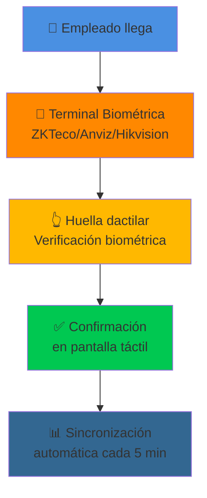
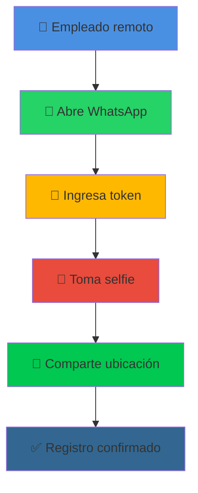
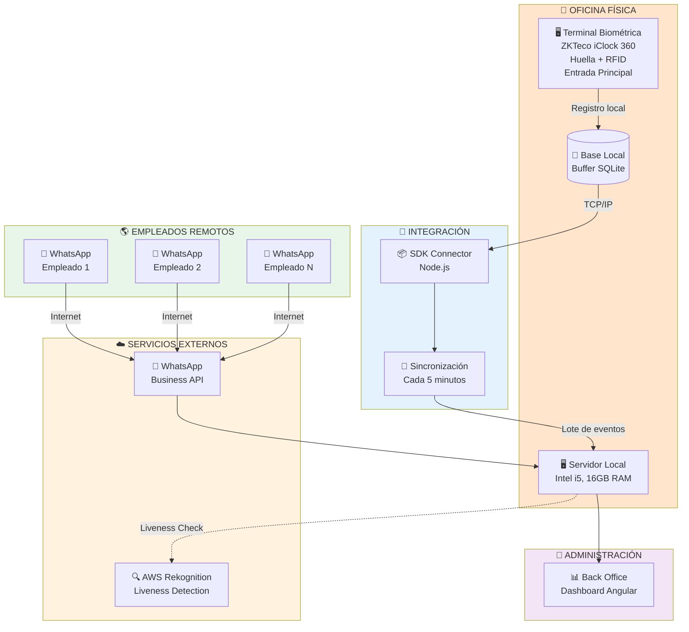
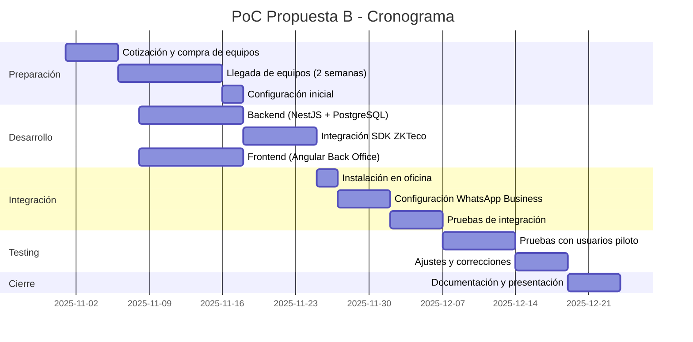
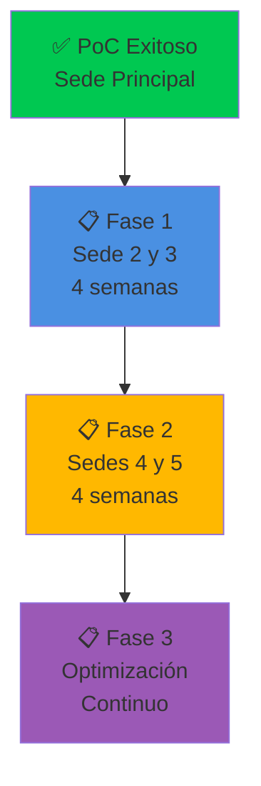

# 🟠 PROPUESTA B: EQUIPO COMERCIAL
## Biométrico Certificado + WhatsApp Remoto

---

<div align="center">


</div>

---

## 🎯 CONCEPTO DE LA SOLUCIÓN

<table>
<tr>
<td width="50%" valign="top">

### 💼 Para Empleados On-site

<div align="center">



</div>

**Tiempo total: < 2 segundos**

✅ Equipo certificado ISO
✅ Verificación biométrica por huella dactilar
✅ Funciona offline con sincronización

</td>
<td width="50%" valign="top">

### 🌎 Para Empleados Remotos

<div align="center">



</div>

**Tiempo total: ~20 segundos**

✅ Mismo proceso que Propuesta A
✅ Validación facial + ubicación
✅ Sin apps adicionales

</td>
</tr>
</table>

---

## 💡 PROPUESTA DE VALOR

<div align="center">

### ¿Por qué elegir equipos comerciales certificados?

</div>

<table>
<tr>
<td width="33%" align="center" valign="top">

### 🏆
**MÁXIMA SEGURIDAD**

Equipos con certificación:
- ISO 9001
- CE (Conformité Européenne)
- FCC (Federal Communications)
- Homologados internacionalmente

</td>
<td width="33%" align="center" valign="top">

### 🛡️
**RESPALDO CORPORATIVO**

Ventajas de fabricantes líderes:
- Soporte técnico 24/7
- Garantía de 2-3 años
- Actualizaciones de firmware
- Red de service partners

</td>
<td width="33%" align="center" valign="top">

### 🔧
**MENOR RIESGO**

Tecnología probada en:
- 1000s de empresas globalmente
- Aeropuertos y bancos
- Entornos de alta seguridad
- Cumplimiento normativo

</td>
</tr>
</table>

---

## 🏗️ ARQUITECTURA DE LA SOLUCIÓN

<div align="center">



</div>

### 📦 Componentes del Sistema

<table>
<thead>
<tr>
<th width="30%">Componente</th>
<th width="50%">Descripción</th>
<th width="20%">Beneficio Clave</th>
</tr>
</thead>
<tbody>
<tr>
<td>🖥️ <strong>Terminal Biométrica</strong></td>
<td>Equipo comercial con pantalla táctil, sensor de huella dactilar + RFID, memoria interna 30,000 registros</td>
<td><strong>Certificación</strong> internacional, garantía fabricante</td>
</tr>
<tr>
<td>📦 <strong>SDK Oficial</strong></td>
<td>Kit de desarrollo del fabricante para integración con sistemas propios</td>
<td>Soporte técnico y <strong>actualizaciones</strong> garantizadas</td>
</tr>
<tr>
<td>🔄 <strong>Sincronización</strong></td>
<td>Servicio que transfiere registros del equipo al servidor central cada 5 minutos</td>
<td>Funciona <strong>offline</strong>, sin pérdida de datos</td>
</tr>
<tr>
<td>💬 <strong>WhatsApp Business</strong></td>
<td>Canal para empleados remotos (idéntico a Propuesta A)</td>
<td><strong>Familiar</strong> y accesible para todos</td>
</tr>
<tr>
<td>⚙️ <strong>Servidor Central</strong></td>
<td>Aplicación web que centraliza registros de equipos y WhatsApp</td>
<td>Visibilidad <strong>unificada</strong></td>
</tr>
<tr>
<td>📊 <strong>Back Office</strong></td>
<td>Panel web para administradores</td>
<td>Control en <strong>tiempo real</strong></td>
</tr>
</tbody>
</table>

---

## 🔐 VALIDACIONES DE SEGURIDAD

### Para Empleados On-site (Terminal Comercial)

<div align="center">

| # | Validación | Objetivo |
|:-:|------------|----------|
| 1️⃣ | **Huella dactilar** | Identificación biométrica única |
| 2️⃣ | **Usuario registrado** | Validar que esté en base del equipo |
| 3️⃣ | **Almacenamiento local** | Registro en memoria interna del equipo |
| 4️⃣ | **Sincronización segura** | Transferencia cifrada al servidor central |
| 5️⃣ | **Validación de duplicados** | El servidor verifica no-duplicación |
| 6️⃣ | **Firma digital** | Hash SHA-256 en servidor central |

</div>

**Ventaja única:** Funciona 100% offline. Si se cae internet, el equipo sigue registrando y sincroniza cuando se restaura la conexión.

### Para Empleados Remotos (WhatsApp)

Idéntico a Propuesta A (ver documento 01-PROPUESTA-A-HIBRIDA.md)

---

## 💰 INVERSIÓN Y COSTOS

### Desglose Financiero

<table>
<thead>
<tr>
<th width="40%">Concepto</th>
<th width="15%" align="center">Cantidad</th>
<th width="20%" align="right">Precio Unit.</th>
<th width="25%" align="right">Subtotal</th>
</tr>
</thead>
<tbody>

<tr style="background-color: #FFE5CC;">
<td colspan="4"><strong>💰 INVERSIÓN INICIAL (Una sola vez)</strong></td>
</tr>

<tr>
<td>🖥️ <strong>Terminal ZKTeco iClock 360</strong><br/><sub>Huella + RFID, TCP/IP, 30,000 usuarios</sub></td>
<td align="center">1</td>
<td align="right">S/ 1,938</td>
<td align="right"><strong>S/ 1,938</strong></td>
</tr>

<tr>
<td>🔌 Switch de red (PoE, 8 puertos)</td>
<td align="center">1</td>
<td align="right">S/ 300</td>
<td align="right"><strong>S/ 300</strong></td>
</tr>

<tr>
<td>🖥️ Servidor Local Físico<br/><sub>Intel i5, 16GB RAM, 512GB SSD</sub></td>
<td align="center">1</td>
<td align="right">S/ 2,500</td>
<td align="right"><strong>S/ 2,500</strong></td>
</tr>

<tr>
<td>🔧 Instalación profesional<br/><sub>Por técnico certificado ZKTeco - 1 terminal</sub></td>
<td align="center">-</td>
<td align="right">-</td>
<td align="right"><strong>S/ 600</strong></td>
</tr>

<tr style="background-color: #f9f9f9; font-weight: bold;">
<td colspan="3"><strong>TOTAL INVERSIÓN INICIAL</strong></td>
<td align="right"><strong>S/ 5,338</strong></td>
</tr>

<tr><td colspan="4">&nbsp;</td></tr>

<tr style="background-color: #FFF3E0;">
<td colspan="4"><strong>📅 COSTOS OPERATIVOS MENSUALES</strong></td>
</tr>

<tr>
<td>⚡ Electricidad servidor local</td>
<td align="center">1</td>
<td align="right">S/ 75/mes</td>
<td align="right"><strong>S/ 75</strong></td>
</tr>

<tr>
<td>💬 WhatsApp Business API<br/><sub>Conversaciones iniciadas por usuario = GRATIS<br/>Solo se cobra si envías recordatorios automáticos</sub></td>
<td align="center">1</td>
<td align="right">S/ 0/mes</td>
<td align="right"><strong>S/ 0</strong></td>
</tr>

<tr>
<td>🔍 Liveness detection (AWS Rekognition)</td>
<td align="center">-</td>
<td align="right">S/ 0.004/validación</td>
<td align="right"><strong>S/ 131.25</strong></td>
</tr>

<tr>
<td>💾 Backups y almacenamiento</td>
<td align="center">1</td>
<td align="right">S/ 50/mes</td>
<td align="right"><strong>S/ 50</strong></td>
</tr>

<tr style="background-color: #f9f9f9; font-weight: bold;">
<td colspan="3"><strong>TOTAL MENSUAL (sin recordatorios)</strong></td>
<td align="right"><strong>S/ 256.25/mes</strong></td>
</tr>

<tr style="background-color: #f9f9f9; font-weight: bold;">
<td colspan="3"><strong>TOTAL ANUAL</strong></td>
<td align="right"><strong>S/ 3,075/año</strong></td>
</tr>

<tr><td colspan="4">&nbsp;</td></tr>

<tr style="background-color: #E8F5E9;">
<td colspan="4"><strong>💡 OPCIÓN CON RECORDATORIOS AUTOMÁTICOS (Opcional)</strong></td>
</tr>

<tr>
<td>💬 WhatsApp - Recordatorios proactivos<br/><sub>Solo empleados remotos, ~220 mensajes/mes</sub></td>
<td align="center">Opcional</td>
<td align="right">S/ 44/mes</td>
<td align="right"><strong>+ S/ 44</strong></td>
</tr>

<tr style="background-color: #f9f9f9; font-weight: bold;">
<td colspan="3"><strong>TOTAL MENSUAL (con recordatorios)</strong></td>
<td align="right"><strong>S/ 300.25/mes</strong></td>
</tr>

<tr><td colspan="4">&nbsp;</td></tr>

<tr style="background-color: #E8F5E9;">
<td colspan="4"><strong>🛡️ SOPORTE TÉCNICO (OPCIONAL)</strong></td>
</tr>

<tr>
<td>📞 Soporte ZKTeco Annual</td>
<td align="center">1</td>
<td align="right">S/ 750/año</td>
<td align="right"><strong>S/ 750</strong></td>
</tr>

</tbody>
</table>

### 📊 Proyección a 3 Años

<div align="center">

**Escenario Base (Sin recordatorios automáticos):**

| Año | Inversión | Operativo | Soporte (opc.) | Acumulado |
|:---:|----------:|----------:|---------------:|----------:|
| **0** | S/ 5,338 | - | - | S/ 5,338 |
| **1** | - | S/ 3,075 | S/ 750 | S/ 9,163 |
| **2** | - | S/ 3,075 | S/ 750 | S/ 12,988 |
| **3** | - | S/ 3,075 | S/ 750 | **S/ 16,813** |

**Sin soporte opcional: S/ 14,563**

**Costo mensual promedio: S/ 468/mes (con soporte) | S/ 405/mes (sin soporte)**

---

**Escenario con Recordatorios (Opcional):**

| Año | Inversión | Operativo | Soporte (opc.) | Acumulado |
|:---:|----------:|----------:|---------------:|----------:|
| **0** | S/ 5,338 | - | - | S/ 5,338 |
| **1** | - | S/ 3,603 | S/ 750 | S/ 9,691 |
| **2** | - | S/ 3,603 | S/ 750 | S/ 14,044 |
| **3** | - | S/ 3,603 | S/ 750 | **S/ 18,397** |

**Costo mensual promedio: S/ 513/mes (con soporte)**

</div>

---

## ✅ VENTAJAS COMPETITIVAS

<table>
<tr>
<td width="50%" valign="top">

### ✨ Fortalezas

1. **🏆 Certificación internacional** (ISO, CE, FCC)
2. **🔒 Seguridad biométrica certificada** (huella dactilar)
3. **🛡️ Garantía de fabricante** (2-3 años)
4. **📞 Soporte técnico oficial** 24/7
5. **⚡ Implementación rápida** (4-6 semanas)
6. **💾 Funciona offline** (buffer local automático)
7. **🔄 Actualizaciones de firmware** incluidas
8. **🌍 Tecnología probada** globalmente
9. **📈 Escalable** a múltiples sedes
10. **✅ Cumplimiento SUNAFIL** garantizado

</td>
<td width="50%" valign="top">

### ⚠️ Consideraciones

1. **💰 Mayor inversión inicial** (S/ 5,338)
2. **🔗 Dependencia del fabricante** para repuestos
3. **🔧 Requiere instalación profesional**
4. **📝 Licencias SDK** (generalmente incluidas, pero verificar)
5. **⏳ Lead time de equipos** (2-3 semanas si no hay stock local)
6. **🔌 Consumo eléctrico** moderado (considerar UPS)

</td>
</tr>
</table>

---

## 🎬 CASOS DE USO

### Escenario 1: Empresa con Alto Riesgo de Fraude

<table>
<tr>
<td width="50%" valign="top">

#### 📍 Contexto

- Industria con historial de fraude biométrico
- Auditorías frecuentes y estrictas
- Necesidad de certificaciones internacionales
- Presupuesto disponible para inversión inicial

</td>
<td width="50%" valign="top">

#### ✅ Solución

- Equipos ZKTeco con biometría de huella dactilar certificada
- Certificados ISO para mostrar en auditorías
- Soporte técnico del fabricante como respaldo
- Reportes con sello de validación del equipo

</td>
</tr>
</table>

**Resultado esperado:**
- 🔒 Cero fraudes exitosos
- ✅ Aprobación en auditorías externas
- 🏆 Certificación que genera confianza en clientes/socios
- 📊 Reportes con trazabilidad certificada

---

### Escenario 2: Empresa con Múltiples Sedes

<table>
<tr>
<td width="50%" valign="top">

#### 📍 Contexto

- 5 oficinas en diferentes ciudades
- 150 empleados totales
- Necesidad de visibilidad centralizada
- Infraestructura de red existente

</td>
<td width="50%" valign="top">

#### ✅ Solución

- 1-2 terminales por sede (10 terminales totales)
- Servidor central en nube
- Sincronización automática cada 5 minutos
- Dashboard unificado para gerencia

</td>
</tr>
</table>

**Resultado esperado:**
- 🌍 Control unificado de todas las sedes
- ⚡ Visibilidad en tiempo real de asistencia nacional
- 📊 Reportes consolidados para gerencia general
- 🔧 Soporte técnico local del fabricante en cada ciudad

---

## 📊 PLAN DE IMPLEMENTACIÓN (PoC)

### Fase 1: Preparación (Semanas 1-2)

<div align="center">



</div>

### Entregables del PoC

<table>
<thead>
<tr>
<th width="30%">Entregable</th>
<th width="50%">Descripción</th>
<th width="20%">Semana</th>
</tr>
</thead>
<tbody>
<tr>
<td>🖥️ <strong>Equipo Instalado</strong></td>
<td>1 terminal ZKTeco configurada y operativa</td>
<td align="center">3</td>
</tr>
<tr>
<td>🔌 <strong>SDK Integrado</strong></td>
<td>Conector funcional entre equipos y backend</td>
<td align="center">4</td>
</tr>
<tr>
<td>⚙️ <strong>Backend Funcional</strong></td>
<td>API REST con sincronización automática</td>
<td align="center">3</td>
</tr>
<tr>
<td>📊 <strong>Back Office</strong></td>
<td>Panel web con gestión completa</td>
<td align="center">3</td>
</tr>
<tr>
<td>💬 <strong>WhatsApp Integrado</strong></td>
<td>Flujos de marcación remota</td>
<td align="center">5</td>
</tr>
<tr>
<td>👥 <strong>Testing con Usuarios</strong></td>
<td>10 usuarios reales probando sistema completo</td>
<td align="center">6</td>
</tr>
<tr>
<td>📈 <strong>Reporte de Resultados</strong></td>
<td>Métricas, KPIs y recomendaciones</td>
<td align="center">7</td>
</tr>
</tbody>
</table>

### Criterios de Éxito del PoC

<div align="center">

| KPI | Objetivo | Medición |
|-----|----------|----------|
| ⏱️ **Tiempo de marcación on-site** | < 2 seg | Promedio de 100 registros |
| 🎯 **Tasa de éxito biométrico** | > 99.5% | Lecturas exitosas / intentos |
| 🔄 **Sincronización exitosa** | > 99.9% | Registros sincronizados / totales |
| 💾 **Funcionalidad offline** | 100% | Pruebas con desconexión simulada |
| 🔒 **Intentos de fraude detectados** | 100% | Intentos simulados bloqueados |
| 👥 **Satisfacción de usuarios** | > 4.5/5 ⭐ | Encuesta post-PoC |
| ✅ **Disponibilidad del sistema** | > 99.9% | Uptime durante PoC |

</div>

---

## 🚀 ROADMAP POST-POC

### Escalamiento a Múltiples Sedes

<div align="center">



</div>

#### Estrategia de Expansión

1. **Validación en sede principal** (PoC)
2. **Despliegue gradual** a sedes secundarias (1-2 por mes)
3. **Capacitación local** en cada sede
4. **Soporte técnico** del fabricante en cada región
5. **Consolidación** de reportes en dashboard central

---

## 📞 SOPORTE Y MANTENIMIENTO

### Modelo de Soporte Combinado

<table>
<tr>
<td width="50%" valign="top">

#### 🏭 Soporte del Fabricante (ZKTeco)

✅ Garantía de equipos (2 años)
✅ Reemplazo de hardware defectuoso
✅ Actualizaciones de firmware
✅ Soporte técnico telefónico
✅ Red de service partners

**Costo:** S/ 750/año (opcional)

</td>
<td width="50%" valign="top">

#### 💻 Soporte del Sistema (Desarrollo Propio)

✅ Mantenimiento del backend/frontend
✅ Actualizaciones de software
✅ Ajustes y mejoras
✅ Capacitaciones adicionales
✅ Soporte por email/chat

**Costo:** Incluido (desarrollo interno)

</td>
</tr>
</table>

---

## 💼 CASO DE NEGOCIO

### ROI Estimado

<table>
<tr>
<td width="50%" valign="top">

#### 💰 Ahorros Anuales

| Concepto | Ahorro |
|----------|-------:|
| Reducción tiempo reportes | S/ 12,600 |
| Evitar multas SUNAFIL (riesgo) | S/ 1,875 |
| Reducción errores administrativos | S/ 3,750 |
| Optimización tiempos de marcación | S/ 3,000 |
| Reducción fraude laboral | S/ 4,500 |
| **TOTAL ANUAL** | **S/ 25,725** |

</td>
<td width="50%" valign="top">

#### 📊 Retorno de Inversión

```
Inversión Año 1 (sin recordatorios):
  Inicial: S/ 5,338
  Operativo: S/ 3,075
  Soporte: S/ 750
  Total: S/ 9,163

Ahorro Año 1: S/ 25,725

ROI = (25,725 - 9,163) / 9,163
ROI = 181%

Payback: 4.3 meses
```

</td>
</tr>
</table>

---

## 🎯 IDEAL PARA

<div align="center">

### ✅ Esta propuesta es perfecta si tu organización:

</div>

<table>
<tr>
<td width="50%" valign="top">

- ✅ Requiere **seguridad biométrica certificada**
- ✅ Necesita **certificaciones internacionales** (ISO, CE)
- ✅ Tiene múltiples **sedes** o planea expandirse
- ✅ Valora el **soporte técnico oficial** del fabricante
- ✅ Puede invertir **S/ 5,338 iniciales**
- ✅ Busca equipos **probados globalmente**
- ✅ Industria **regulada** o con auditorías estrictas
- ✅ Necesita **funcionalidad offline** garantizada

</td>
<td width="50%" valign="top">

### ❌ NO es ideal si:

- ❌ Presupuesto inicial muy limitado (< S/ 3,750)
- ❌ Solo tienes empleados 100% remotos
- ❌ Necesitas implementación **urgente** (< 3 semanas por lead time de equipos)
- ❌ Startup en fase muy temprana (MVP)
- ❌ No cuentas con infraestructura de red

</td>
</tr>
</table>

---

## 🏭 TERMINALES COMERCIALES RECOMENDADAS

### Equipos Certificados con Pantalla Táctil

<table>
<thead>
<tr>
<th width="20%">Marca/Modelo</th>
<th width="35%">Características</th>
<th width="20%">Precio Referencial</th>
<th width="25%">Dónde Comprar en Perú</th>
</tr>
</thead>
<tbody>

<tr>
<td><strong>🥇 ZKTeco iClock 360</strong><br/>(Recomendado)</td>
<td>
• <strong>Pantalla táctil TFT 3.5"</strong> a color<br/>
• Sensor de huella capacitivo<br/>
• Lector RFID integrado<br/>
• Capacidad: 30,000 usuarios<br/>
• WiFi + TCP/IP + USB<br/>
• Certificación ISO 9001<br/>
• Batería backup 4 horas<br/>
• Software ZKTime incluido
</td>
<td align="center"><strong>S/ 1,850 - S/ 2,100</strong></td>
<td>
• <strong>ZKTeco Perú</strong> (distribuidor oficial)<br/>
• <strong>Sistemas de Seguridad SAC</strong><br/>
• <strong>Mercado Libre</strong> (vendedores certificados)<br/>
• Importadores en Av. Wilson
</td>
</tr>

<tr>
<td><strong>🥈 ZKTeco K50</strong></td>
<td>
• Pantalla TFT 2.8" a color<br/>
• Sensor de huella óptico<br/>
• Capacidad: 3,000 usuarios<br/>
• TCP/IP + WiFi<br/>
• Certificado ISO<br/>
• Software de gestión incluido
</td>
<td align="center"><strong>S/ 1,600 - S/ 1,850</strong></td>
<td>
• <strong>Distribuidores ZKTeco</strong><br/>
• <strong>Linio Perú</strong><br/>
• Tiendas de seguridad electrónica<br/>
• Av. Wilson - Centro Lima
</td>
</tr>

<tr>
<td><strong>🥉 Anviz A300</strong></td>
<td>
• Pantalla TFT 3.0"<br/>
• Sensor biométrico<br/>
• Capacidad: 3,000 usuarios<br/>
• TCP/IP + USB<br/>
• Software CrossChex incluido
</td>
<td align="center"><strong>S/ 1,700 - S/ 1,950</strong></td>
<td>
• <strong>Importadores Anviz</strong><br/>
• <strong>Ripley.com.pe</strong><br/>
• Distribuidores San Isidro<br/>
• Mercado Libre Perú
</td>
</tr>

<tr>
<td><strong>Hikvision DS-K1T802M</strong></td>
<td>
• Pantalla táctil 4.3"<br/>
• Sensor de huella<br/>
• Capacidad: 10,000 usuarios<br/>
• TCP/IP + WiFi<br/>
• Certificación CE/FCC
</td>
<td align="center"><strong>S/ 2,000 - S/ 2,300</strong></td>
<td>
• <strong>Hikvision Perú</strong> (oficial)<br/>
• Distribuidores corporativos<br/>
• Tiendas especializadas<br/>
• San Isidro - Lima
</td>
</tr>

</tbody>
</table>

### 🏪 Distribuidores Autorizados en Lima

<table>
<tr>
<td width="50%" valign="top">

#### 📍 Distribuidores Oficiales

**ZKTeco Perú SAC**
- 📍 Av. Javier Prado Este 2875, San Borja
- 📞 Contacto: (01) 717-9200
- ✅ Instalación y soporte técnico
- ✅ Capacitación incluida
- ✅ Garantía de 2 años

**Sistemas de Seguridad SAC**
- 📍 Av. República de Panamá 3418, San Isidro
- 📞 Ventas corporativas disponibles
- ✅ Servicio post-venta
- ✅ Mantenimiento preventivo

**Hikvision Perú**
- 📍 Oficinas en San Isidro
- ✅ Red de instaladores certificados
- ✅ Soporte técnico 24/7
- ✅ Garantía extendida disponible

</td>
<td width="50%" valign="top">

#### 🌐 Compra Online en Perú

**Marketplaces Confiables:**
- **Mercado Libre Perú**
  - Buscar: "ZKTeco iClock 360"
  - Verificar vendedor certificado
  - Garantía mínima 12 meses

- **Linio Perú**
  - Envíos a todo el Perú
  - Pago con tarjeta o efectivo
  - Garantía corporativa

- **Ripley.com.pe**
  - Equipos para empresas
  - Crédito disponible
  - Instalación opcional

**Recomendación:** Comprar con distribuidores oficiales para garantizar soporte técnico y repuestos.

</td>
</tr>
</table>

### 💡 Recomendación Final - Propuesta B

Para la **Propuesta B**, recomendamos el **ZKTeco iClock 360** por:
- ✅ **Certificación ISO 9001** para auditorías
- ✅ **Pantalla táctil grande** (3.5") fácil de usar
- ✅ **30,000 usuarios** - Escalable a largo plazo
- ✅ **Distribuidor oficial en Lima** con soporte local
- ✅ **Repuestos disponibles** en Perú
- ✅ **Software ZKTime incluido** (gestión completa)
- ✅ **Batería backup 4 horas** - Funciona sin electricidad
- ✅ **WiFi + TCP/IP** - Máxima flexibilidad de instalación

**Precio estimado completo (1 terminal instalada):** S/ 2,500 - S/ 2,800

**Incluye:**
- 1 terminal ZKTeco iClock 360
- Software de gestión
- Instalación profesional
- Capacitación básica (2 horas)
- Garantía 24 meses

**Nota:** Si necesitas más terminales, cada una adicional cuesta aproximadamente S/ 2,200 - S/ 2,400 (equipo + instalación)

---

### 📋 Checklist de Compra

Antes de comprar, verificar:
- ☑️ Garantía mínima 24 meses
- ☑️ Software en español incluido
- ☑️ Soporte técnico en Perú
- ☑️ Instalación profesional disponible
- ☑️ Repuestos disponibles localmente
- ☑️ Certificaciones ISO/CE vigentes
- ☑️ Manual de usuario en español

---

<div align="center">

## 📚 DOCUMENTACIÓN RELACIONADA

[](./00-RESUMEN-EJECUTIVO.md)
[](./01-PROPUESTA-A-HIBRIDA.md)
[](./03-PROPUESTA-C-WHATSAPP.md)
[](./04-COMPARATIVA.md)

---

**Propuesta B: Equipo Comercial Certificado** | Versión 1.0 | Octubre 2025

</div>
