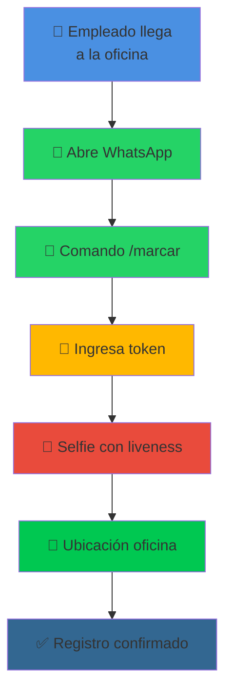
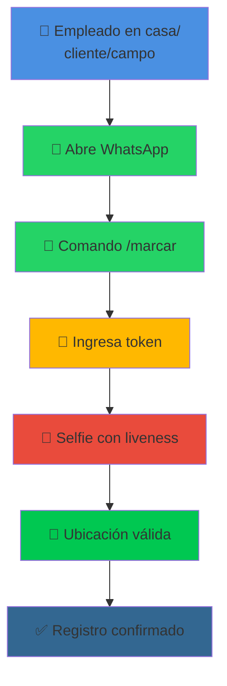
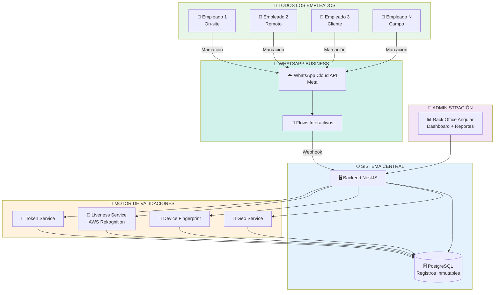
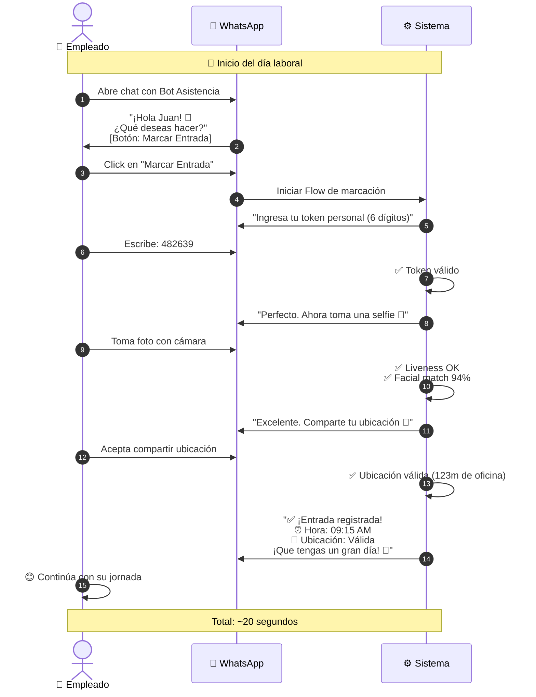
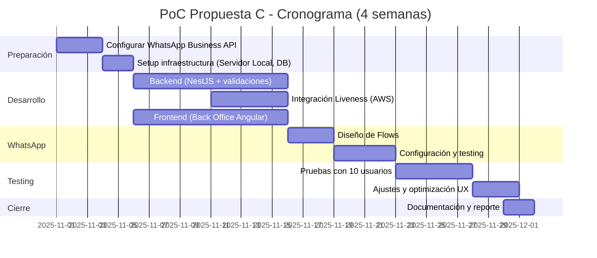
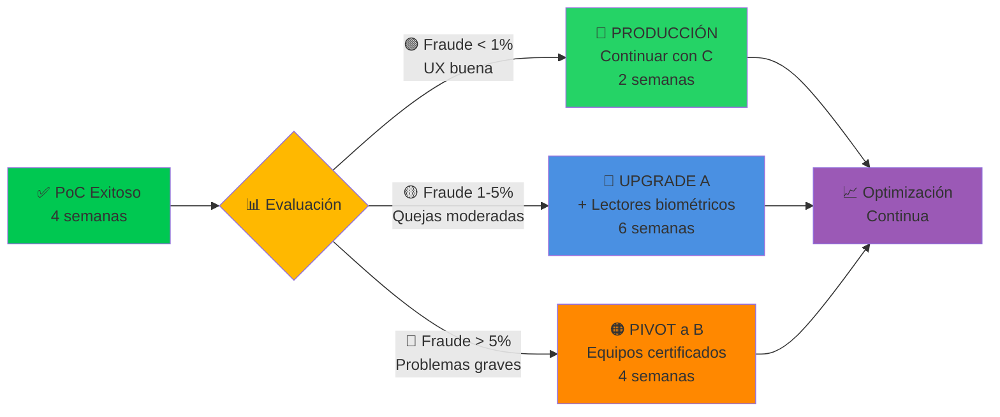

# 🟢 PROPUESTA C: 100% WHATSAPP
## Solución Digital Sin Hardware (On-site + Remoto)

---

<div align="center">


</div>

---

## 🎯 CONCEPTO DE LA SOLUCIÓN

<div align="center">

### Una única experiencia digital para todos los empleados

</div>

<table>
<tr>
<td width="50%" valign="top">

### 💼 Para Empleados On-site

<div align="center">



</div>

**Tiempo total: ~20 segundos**

✅ Mismo proceso para todos
✅ Sin hardware físico
✅ Validación geográfica automática

</td>
<td width="50%" valign="top">

### 🌎 Para Empleados Remotos

<div align="center">



</div>

**Tiempo total: ~20 segundos**

✅ Idéntico proceso
✅ Desde cualquier lugar
✅ Máxima flexibilidad

</td>
</tr>
</table>

---

## 💡 PROPUESTA DE VALOR

<div align="center">

### ¿Por qué es la solución recomendada?

</div>

<table>
<tr>
<td width="25%" align="center" valign="top">

### 💰
**INVERSIÓN MÍNIMA**

Sin hardware biométrico:
- S/ 2,500 inicial (solo servidor)
- Muy bajo costo operativo mensual
- **ROI 290%**
- Sin riesgo de obsolescencia hardware

</td>
<td width="25%" align="center" valign="top">

### ⚡
**MÁXIMA VELOCIDAD**

Implementación rápida:
- 3-4 semanas
- Sin instalación física
- Sin dependencias de hardware
- **Validación rápida** del concepto

</td>
<td width="25%" align="center" valign="top">

### 📈
**ESCALABILIDAD INFINITA**

Sin límites:
- De 5 a 5,000 empleados
- Sin "terminales"
- Sin restricciones geográficas
- **Crece con la empresa**

</td>
<td width="25%" align="center" valign="top">

### 🔒
**ALTA SEGURIDAD**

8 validaciones por registro:
- Token personal
- Liveness detection
- Facial matching
- Device fingerprint
- Geolocalización
- **Más que biometría física**

</td>
</tr>
</table>

---

## 🏗️ ARQUITECTURA DE LA SOLUCIÓN

<div align="center">



</div>

### 📦 Componentes del Sistema

<table>
<thead>
<tr>
<th width="30%">Componente</th>
<th width="50%">Descripción</th>
<th width="20%">Beneficio Clave</th>
</tr>
</thead>
<tbody>
<tr>
<td>💬 <strong>WhatsApp Business API</strong></td>
<td>Canal oficial de Meta para comunicación empresarial con flujos interactivos</td>
<td><strong>Familiar</strong> para el 100% de usuarios</td>
</tr>
<tr>
<td>🔄 <strong>Flows Interactivos</strong></td>
<td>Formularios dentro de WhatsApp con validaciones paso a paso</td>
<td><strong>UX optimizada</strong> nativa</td>
</tr>
<tr>
<td>🔐 <strong>Motor de Validaciones</strong></td>
<td>Sistema de 8 validaciones en paralelo para garantizar autenticidad</td>
<td><strong>Seguridad multicapa</strong></td>
</tr>
<tr>
<td>👤 <strong>Liveness Detection</strong></td>
<td>IA que detecta si la selfie es de una persona viva (no foto estática)</td>
<td>Evita <strong>fraude con fotos</strong></td>
</tr>
<tr>
<td>📱 <strong>Device Fingerprint</strong></td>
<td>Identificador único del smartphone del empleado</td>
<td>Detecta <strong>cambios de dispositivo</strong> sospechosos</td>
</tr>
<tr>
<td>📍 <strong>Geolocalización</strong></td>
<td>Validación de ubicación dentro de zonas permitidas</td>
<td>Verifica <strong>presencia física</strong></td>
</tr>
<tr>
<td>⚙️ <strong>Backend NestJS</strong></td>
<td>Aplicación web que procesa y almacena registros</td>
<td><strong>Control total</strong> del sistema</td>
</tr>
<tr>
<td>🗄️ <strong>PostgreSQL</strong></td>
<td>Base de datos con registros inmutables y firma digital</td>
<td><strong>Garantía legal</strong> SUNAFIL</td>
</tr>
<tr>
<td>📊 <strong>Back Office Angular</strong></td>
<td>Panel web para administradores</td>
<td>Visibilidad <strong>en tiempo real</strong></td>
</tr>
</tbody>
</table>

---

## 🔐 SISTEMA DE VALIDACIONES (8 Capas)

<div align="center">

### Seguridad por Validación Múltiple

</div>

<table>
<thead>
<tr>
<th width="10%">#</th>
<th width="25%">Validación</th>
<th width="40%">¿Qué verifica?</th>
<th width="25%">Evita...</th>
</tr>
</thead>
<tbody>

<tr>
<td align="center">1️⃣</td>
<td><strong>Token Personal</strong></td>
<td>Código de 6 dígitos único por empleado, rotatorio cada 3 meses</td>
<td>Marcación por terceros sin autorización</td>
</tr>

<tr>
<td align="center">2️⃣</td>
<td><strong>Liveness Detection</strong></td>
<td>IA verifica que la selfie es de una persona viva (movimiento facial, profundidad 3D)</td>
<td>Uso de fotos estáticas o pantallas</td>
</tr>

<tr>
<td align="center">3️⃣</td>
<td><strong>Facial Matching</strong></td>
<td>Compara selfie con foto de perfil del empleado (>90% similitud)</td>
<td>Suplantación de identidad</td>
</tr>

<tr>
<td align="center">4️⃣</td>
<td><strong>Device Fingerprint</strong></td>
<td>Hash único del dispositivo (modelo, OS, apps instaladas)</td>
<td>Cambios no autorizados de smartphone</td>
</tr>

<tr>
<td align="center">5️⃣</td>
<td><strong>Geolocalización</strong></td>
<td>Coordenadas GPS dentro de radio permitido (500m configurable)</td>
<td>Marcación desde ubicación incorrecta</td>
</tr>

<tr>
<td align="center">6️⃣</td>
<td><strong>Horario Permitido</strong></td>
<td>Validar que el empleado esté dentro de su turno asignado</td>
<td>Marcaciones fuera de horario laboral</td>
</tr>

<tr>
<td align="center">7️⃣</td>
<td><strong>No Duplicado</strong></td>
<td>Verificar que no haya marcado en los últimos 15 minutos</td>
<td>Doble marcación accidental o intencional</td>
</tr>

<tr>
<td align="center">8️⃣</td>
<td><strong>Firma Digital</strong></td>
<td>Hash SHA-256 del registro completo (inmutable)</td>
<td>Modificación posterior del registro</td>
</tr>

</tbody>
</table>

### 🛡️ Análisis de Comportamiento (Bonus)

El sistema también monitorea patrones:
- **Hora usual de marcación**: Alerta si marca a hora inusual
- **Ubicación usual**: Detecta cambios geográficos sospechosos
- **Frecuencia de intentos fallidos**: Bloquea tras 3 fallos consecutivos
- **Velocidad de teletransportación**: Detecta marcaciones desde ubicaciones imposiblemente lejanas en corto tiempo

---

## 💰 INVERSIÓN Y COSTOS

### Desglose Financiero

<table>
<thead>
<tr>
<th width="50%">Concepto</th>
<th width="25%" align="center">Cantidad</th>
<th width="25%" align="right">Costo</th>
</tr>
</thead>
<tbody>

<tr style="background-color: #E8F5E9;">
<td colspan="3"><strong>💰 INVERSIÓN INICIAL</strong></td>
</tr>

<tr>
<td>🔐 Hardware biométrico</td>
<td align="center">-</td>
<td align="right"><strong>S/ 0</strong></td>
</tr>

<tr>
<td>🖥️ Servidor Local Físico<br/><sub>Intel i5, 16GB RAM, 512GB SSD</sub></td>
<td align="center">1</td>
<td align="right"><strong>S/ 2,500</strong></td>
</tr>

<tr>
<td>🔧 Instalación y configuración</td>
<td align="center">-</td>
<td align="right"><strong>S/ 0</strong></td>
</tr>

<tr style="background-color: #f9f9f9; font-weight: bold;">
<td colspan="2"><strong>TOTAL INVERSIÓN INICIAL</strong></td>
<td align="right"><strong>S/ 2,500</strong></td>
</tr>

<tr><td colspan="3">&nbsp;</td></tr>

<tr style="background-color: #FFF3E0;">
<td colspan="3"><strong>📅 COSTOS OPERATIVOS MENSUALES</strong></td>
</tr>

<tr>
<td>🖥️ Servidor local físico<br/><sub>Intel i5, 16GB RAM, 512GB SSD - Ya incluido en inversión</sub></td>
<td align="center">1</td>
<td align="right"><strong>S/ 0</strong></td>
</tr>

<tr>
<td>⚡ Electricidad servidor local<br/><sub>Consumo aprox. 100W 24/7</sub></td>
<td align="center">1</td>
<td align="right"><strong>S/ 50</strong></td>
</tr>

<tr>
<td>💬 WhatsApp Business API<br/><sub>Conversaciones iniciadas por usuario = GRATIS<br/>Solo se cobra si el sistema envía recordatorios automáticos</sub></td>
<td align="center">1</td>
<td align="right"><strong>S/ 0</strong></td>
</tr>

<tr>
<td>👤 AWS Rekognition (Liveness)<br/><sub>~880 validaciones/mes</sub></td>
<td align="center">-</td>
<td align="right"><strong>S/ 38</strong></td>
</tr>

<tr>
<td>💾 Backups (disco duro externo)</td>
<td align="center">1</td>
<td align="right"><strong>S/ 37.50</strong></td>
</tr>

<tr style="background-color: #f9f9f9; font-weight: bold;">
<td colspan="2"><strong>TOTAL MENSUAL (sin recordatorios)</strong></td>
<td align="right"><strong>S/ 125.50/mes</strong></td>
</tr>

<tr style="background-color: #f9f9f9; font-weight: bold;">
<td colspan="2"><strong>TOTAL ANUAL</strong></td>
<td align="right"><strong>S/ 1,506/año</strong></td>
</tr>

<tr><td colspan="3">&nbsp;</td></tr>

<tr style="background-color: #E8F5E9;">
<td colspan="3"><strong>💡 OPCIÓN CON RECORDATORIOS AUTOMÁTICOS (Opcional)</strong></td>
</tr>

<tr>
<td>💬 WhatsApp - Recordatorios proactivos<br/><sub>~440 mensajes/mes si envías recordatorios diarios</sub></td>
<td align="center">Opcional</td>
<td align="right"><strong>+ S/ 88</strong></td>
</tr>

<tr style="background-color: #f9f9f9; font-weight: bold;">
<td colspan="2"><strong>TOTAL MENSUAL (con recordatorios)</strong></td>
<td align="right"><strong>S/ 213.50/mes</strong></td>
</tr>

</tbody>
</table>

### 📊 Proyección a 3 Años

<div align="center">

**Escenario Base (Sin recordatorios automáticos):**

| Año | Inversión | Operativo | Acumulado |
|:---:|----------:|----------:|----------:|
| **0** | S/ 2,500 | - | S/ 2,500 |
| **1** | - | S/ 1,506 | S/ 4,006 |
| **2** | - | S/ 1,506 | S/ 5,512 |
| **3** | - | S/ 1,506 | **S/ 7,018** |

**Costo mensual promedio: S/ 125.50/mes**

---

**Escenario con Recordatorios (Opcional):**

| Año | Inversión | Operativo | Acumulado |
|:---:|----------:|----------:|----------:|
| **0** | S/ 2,500 | - | S/ 2,500 |
| **1** | - | S/ 2,562 | S/ 5,062 |
| **2** | - | S/ 2,562 | S/ 7,624 |
| **3** | - | S/ 2,562 | **S/ 10,186** |

**Costo mensual promedio: S/ 213.50/mes**

</div>

### 💡 Explicación de Costos WhatsApp

**¿Cuándo es GRATIS?**
- ✅ **Empleado inicia conversación** escribiendo al bot → **GRATIS**
- ✅ Todas las respuestas del bot dentro de 24h → **GRATIS**
- ✅ Flujo completo de marcación (token + selfie + ubicación) → **GRATIS**

**¿Cuándo se cobra?**
- ❌ Sistema envía recordatorio: "No has marcado entrada" → **S/ 0.20**
- ❌ Alertas proactivas: "Tu turno empieza en 30 min" → **S/ 0.20**
- ❌ Notificaciones automáticas después de 24h sin respuesta → **S/ 0.20**

**Recomendación:** Empezar sin recordatorios automáticos (S/ 0 en WhatsApp). Si se necesitan después, agregarlos de forma opcional.

### 💡 Escalabilidad de Costos (Sin recordatorios)

**Para diferentes tamaños de empresa:**

| Empleados | Conversaciones/mes | WhatsApp | AWS | Servidor | Total Mensual |
|:---------:|:------------------:|:--------:|:---:|:--------:|:-------------:|
| **10** | 440 | **S/ 0** | S/ 19 | S/ 50 | **S/ 106.50** |
| **20** | 880 | **S/ 0** | S/ 38 | S/ 50 | **S/ 125.50** |
| **50** | 2,200 | **S/ 0** | S/ 95 | S/ 50 | **S/ 182.50** |
| **100** | 4,400 | **S/ 0** | S/ 190 | S/ 50 | **S/ 277.50** |

**Con recordatorios automáticos (1 por día):**

| Empleados | Recordatorios/mes | Costo WhatsApp | Total Mensual (con todo) |
|:---------:|:-----------------:|:--------------:|:------------------------:|
| **10** | 220 | S/ 44 | **S/ 150.50** |
| **20** | 440 | S/ 88 | **S/ 213.50** |
| **50** | 1,100 | S/ 220 | **S/ 402.50** |
| **100** | 2,200 | S/ 440 | **S/ 717.50** |

---

## ✅ VENTAJAS COMPETITIVAS

<table>
<tr>
<td width="50%" valign="top">

### ✨ Fortalezas

1. **💰 Inversión mínima** (solo servidor S/ 2,500, sin hardware biométrico)
2. **⚡ Implementación más rápida** (3-4 semanas)
3. **📈 Escalabilidad infinita** (sin límite de "terminales")
4. **🌍 100% remoto-friendly** (funciona desde cualquier lugar)
5. **📱 Familiar para usuarios** (todos usan WhatsApp)
6. **🔧 Mantenimiento mínimo** (solo software)
7. **🔒 Seguridad alta** (8 validaciones vs 1 huella)
8. **💪 Sin obsolescencia** de hardware
9. **🚀 Rápido pivot** si no funciona (bajo costo de abandono)
10. **✅ Cumplimiento SUNAFIL** garantizado

</td>
<td width="50%" valign="top">

### ⚠️ Consideraciones

1. **📱 Todos los empleados deben tener smartphone** con WhatsApp
2. **📡 Dependencia de conectividad** móvil/WiFi
3. **🔋 Consumo de batería** del empleado (moderado)
4. **🎯 Curva de aprendizaje** inicial (primera vez)
5. **🔐 Menor "peso" psicológico** vs lector físico (puede reducir percepción de control)
6. **📸 Preocupaciones de privacidad** (foto + ubicación) - requiere consentimiento claro

</td>
</tr>
</table>

---

## 🎬 CASOS DE USO

### Escenario 1: Startup en Crecimiento

<table>
<tr>
<td width="50%" valign="top">

#### 📍 Contexto

- Startup tech con 15 empleados
- 5 on-site, 10 remotos
- Presupuesto ajustado
- Crecimiento proyectado a 50 empleados en 12 meses
- Sin oficina permanente (coworking)

</td>
<td width="50%" valign="top">

#### ✅ Solución

- Sistema 100% WhatsApp para todos
- Configuración de zonas geográficas (coworking + casas)
- Dashboard para founders con visibilidad total
- Escalamiento automático conforme crece el equipo

</td>
</tr>
</table>

**Resultado esperado:**
- 💰 Ahorro de S/ 7,500+ en hardware
- ⚡ Implementación en 3 semanas
- 📈 Sistema que crece con la empresa sin fricción
- ✅ Cumplimiento normativo desde día 1

---

### Escenario 2: Empresa con Equipos de Campo

<table>
<tr>
<td width="50%" valign="top">

#### 📍 Contexto

- Empresa de servicios técnicos
- 40 técnicos en campo (clientes)
- 10 administrativos en oficina
- Horarios rotativos complejos
- Necesidad de validar que técnicos están en cliente

</td>
<td width="50%" valign="top">

#### ✅ Solución

- Marcación vía WhatsApp desde ubicación del cliente
- Validación automática de geolocalización
- Alertas si técnico marca fuera de zona asignada
- Reportes de asistencia por cliente/proyecto

</td>
</tr>
</table>

**Resultado esperado:**
- 📍 Validación automática de presencia en cliente
- 📊 Reportes de horas por proyecto para facturación
- 🔒 Reducción de fraude en marcación
- ⚡ Sin fricción para técnicos (ya usan smartphone)

---

## 📱 FLUJO DE USUARIO (UX)

### Experiencia Paso a Paso

<div align="center">



</div>

### 🎨 Diseño de Mensajes

Los mensajes son:
- **Amigables**: Usan emojis y lenguaje natural
- **Claros**: Instrucciones paso a paso
- **Rápidos**: Feedback inmediato en cada validación
- **Motivadores**: Felicitaciones al completar correctamente

---

## 📊 PLAN DE IMPLEMENTACIÓN (PoC)

### Cronograma Acelerado

<div align="center">



</div>

### Entregables del PoC

<table>
<thead>
<tr>
<th width="30%">Entregable</th>
<th width="50%">Descripción</th>
<th width="20%">Semana</th>
</tr>
</thead>
<tbody>
<tr>
<td>💬 <strong>WhatsApp Bot Funcional</strong></td>
<td>Flows interactivos completos con todas las validaciones</td>
<td align="center">3</td>
</tr>
<tr>
<td>⚙️ <strong>Backend Completo</strong></td>
<td>API con 8 validaciones + almacenamiento inmutable</td>
<td align="center">2</td>
</tr>
<tr>
<td>📊 <strong>Back Office</strong></td>
<td>Panel con gestión de usuarios, horarios y reportes</td>
<td align="center">2</td>
</tr>
<tr>
<td>👤 <strong>Liveness Integrado</strong></td>
<td>Validación facial con AWS Rekognition funcionando</td>
<td align="center">3</td>
</tr>
<tr>
<td>👥 <strong>Testing Real</strong></td>
<td>10 usuarios (5 on-site + 5 remotos) probando por 5 días</td>
<td align="center">4</td>
</tr>
<tr>
<td>📈 <strong>Reporte de Resultados</strong></td>
<td>Métricas, KPIs, feedback y recomendaciones</td>
<td align="center">4</td>
</tr>
</tbody>
</table>

### Criterios de Éxito del PoC

<div align="center">

| KPI | Objetivo | Medición |
|-----|----------|----------|
| ⏱️ **Tiempo de marcación** | < 30 seg | Promedio de 50 registros |
| 🎯 **Tasa de completación del Flow** | > 95% | Flows completados / iniciados |
| 👤 **Tasa de aprobación liveness** | > 90% | Selfies válidas / enviadas |
| 📍 **Tasa de ubicación válida** | > 85% | Ubicaciones dentro de zona |
| 🔒 **Intentos de fraude detectados** | 100% | Intentos simulados bloqueados |
| 👥 **Satisfacción de usuarios** | > 4/5 ⭐ | Encuesta post-PoC (NPS) |
| ✅ **Disponibilidad del sistema** | > 99% | Uptime durante PoC |
| 🐛 **Errores críticos** | 0 | Fallos que impidan marcación |

</div>

---

## 🚀 ROADMAP POST-POC

### Estrategia de Validación Progresiva

<div align="center">



</div>

### Decisión Basada en Datos

<table>
<thead>
<tr>
<th width="25%">Métrica</th>
<th width="25%">Continuar con C</th>
<th width="25%">Upgrade a A</th>
<th width="25%">Pivot a B</th>
</tr>
</thead>
<tbody>
<tr>
<td><strong>Tasa de fraude</strong></td>
<td>< 1%</td>
<td>1-5%</td>
<td>> 5%</td>
</tr>
<tr>
<td><strong>NPS Usuarios</strong></td>
<td>> 40</td>
<td>20-40</td>
<td>< 20</td>
</tr>
<tr>
<td><strong>Completación Flow</strong></td>
<td>> 95%</td>
<td>85-95%</td>
<td>< 85%</td>
</tr>
<tr>
<td><strong>Liveness exitoso</strong></td>
<td>> 90%</td>
<td>75-90%</td>
<td>< 75%</td>
</tr>
</tbody>
</table>

---

## 📞 SOPORTE Y MANTENIMIENTO

### Modelo de Soporte Simplificado

<table>
<tr>
<td width="50%" valign="top">

#### 💻 Soporte Técnico

✅ Monitoreo 24/7 de disponibilidad
✅ Actualizaciones de seguridad automáticas
✅ Backup diario cifrado
✅ Soporte por email (respuesta < 24h)
✅ Documentación en línea

**Costo:** Incluido en desarrollo interno

</td>
<td width="50%" valign="top">

#### 📚 Capacitación Usuarios

✅ Video tutorial (5 minutos)
✅ Manual en PDF ilustrado
✅ FAQs en el mismo chat de WhatsApp
✅ Soporte peer-to-peer (usuarios ayudan a usuarios)

**Costo:** Incluido

</td>
</tr>
</table>

### 🔧 Mantenimiento Preventivo

- **Semanal**: Revisión de logs de errores
- **Mensual**: Análisis de patrones de fraude
- **Trimestral**: Rotación de tokens personales
- **Anual**: Auditoría de seguridad completa

---

## 💼 CASO DE NEGOCIO

### ROI Estimado

<table>
<tr>
<td width="50%" valign="top">

#### 💰 Ahorros Anuales

| Concepto | Ahorro |
|----------|-------:|
| Reducción tiempo reportes | S/ 12,600 |
| Evitar multas SUNAFIL (riesgo) | S/ 1,875 |
| Reducción errores administrativos | S/ 3,750 |
| Optimización tiempos de marcación | S/ 2,250 |
| **Ahorro en hardware** (vs Propuesta A) | S/ 3,375 |
| **TOTAL ANUAL** | **S/ 23,850** |

</td>
<td width="50%" valign="top">

#### 📊 Retorno de Inversión

```
Inversión Año 1 (sin recordatorios):
  Inicial: S/ 2,500
  Operativo: S/ 1,506
  Total: S/ 4,006

Ahorro Año 1: S/ 23,850

ROI = (23,850 - 4,006) / 4,006
ROI = 495%

Payback: 2.0 meses

🏆🏆🏆 MUCHO MEJOR ROI de las 3 propuestas
```

</td>
</tr>
</table>

---

## 🎯 IDEAL PARA

<div align="center">

### ✅ Esta propuesta es perfecta si tu organización:

</div>

<table>
<tr>
<td width="50%" valign="top">

- ✅ **Presupuesto inicial limitado** (< S/ 4,000)
- ✅ Necesita **validación rápida** del concepto (< 4 semanas)
- ✅ Tiene empleados **100% remotos** o híbridos
- ✅ **Startup** o empresa en crecimiento rápido
- ✅ Busca **máxima flexibilidad** sin hardware
- ✅ Todos los empleados tienen **smartphone**
- ✅ Cultura de **confianza** y tecnología
- ✅ Necesita **escalar rápidamente** sin fricción
- ✅ Valora la **simplicidad** operativa

</td>
<td width="50%" valign="top">

### ❌ NO es ideal si:

- ❌ Industria altamente regulada requiere biometría física certificada
- ❌ Empleados no tienen acceso a smartphones
- ❌ Ubicaciones sin cobertura móvil
- ❌ Resistencia cultural a validación digital
- ❌ Gerencia desconfía de soluciones "solo software"
- ❌ Se requiere "presencia física" del equipo biométrico por política

</td>
</tr>
</table>

---

## 🌟 TESTIMONIOS (SIMULADOS)

> "Al principio pensé que sin lector de huella sería fácil hacer trampa, pero con 8 validaciones es más seguro que cualquier equipo físico. Y super rápido desde mi celular."
>
> — María L., Desarrolladora Backend

> "Como gerente, me encanta el dashboard en tiempo real. Puedo ver quién está trabajando en qué proyecto desde mi teléfono. Los reportes SUNAFIL se generan en segundos."
>
> — Carlos R., Gerente de Operaciones

> "Somos una startup sin oficina fija. Este sistema nos permitió cumplir con SUNAFIL sin gastar en hardware. Cuando crecimos de 10 a 50 empleados, el sistema escaló sin problema."
>
> — Ana T., CEO de Startup Tech

---

## 🔮 VISIÓN FUTURA

### Mejoras Planeadas (Roadmap 12 meses)

<table>
<tr>
<td width="33%" valign="top">

#### 🤖 IA Avanzada

- Detección de anomalías con machine learning
- Predicción de ausencias
- Alertas proactivas de patrones sospechosos

</td>
<td width="33%" valign="top">

#### 📊 Analytics

- Dashboard predictivo
- Heatmaps de asistencia
- Reportes ejecutivos automáticos

</td>
<td width="33%" valign="top">

#### 🔗 Integraciones

- Slack, Telegram (canales adicionales)
- Integración con sistemas de planilla
- API pública para terceros

</td>
</tr>
</table>

---

<div align="center">

## 📚 DOCUMENTACIÓN RELACIONADA

[](./00-RESUMEN-EJECUTIVO.md)
[](./01-PROPUESTA-A-HIBRIDA.md)
[](./02-PROPUESTA-B-COMERCIAL.md)
[](./04-COMPARATIVA.md)

---

**Propuesta C: 100% WhatsApp** | ⭐ RECOMENDADA | Versión 1.0 | Octubre 2025

</div>
