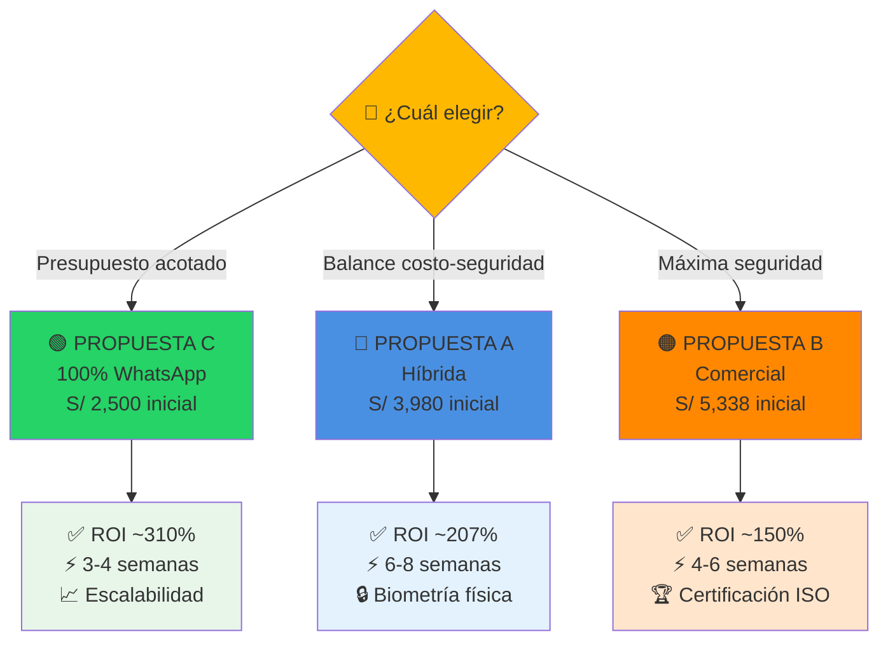
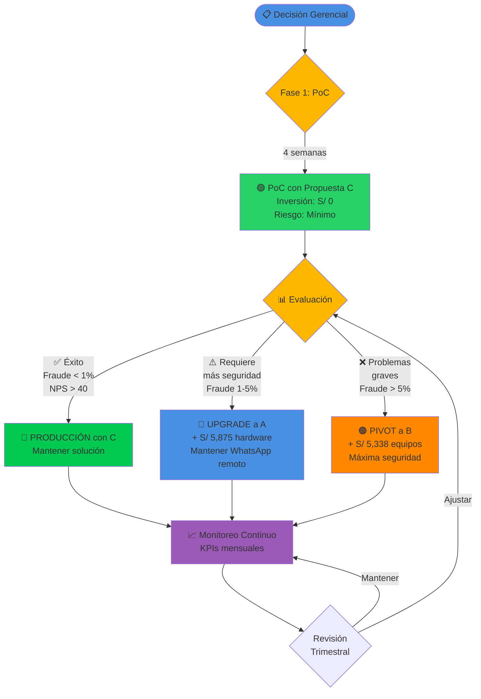

# 📊 COMPARATIVA DETALLADA
## Matriz de Decisión de las 3 Propuestas

---

<div align="center">


</div>

---

## 🎯 RESUMEN VISUAL

<div align="center">



</div>

---

## 💰 COMPARACIÓN FINANCIERA

### Tabla de Inversión y Costos

<table>
<thead>
<tr>
<th width="30%">Concepto</th>
<th width="23%" align="right">🔵 Propuesta A<br/><sub>Híbrida</sub></th>
<th width="23%" align="right">🟠 Propuesta B<br/><sub>Comercial</sub></th>
<th width="24%" align="right">🟢 Propuesta C<br/><sub>WhatsApp</sub></th>
</tr>
</thead>
<tbody>

<tr style="background-color: #f0f8ff;">
<td><strong>💰 INVERSIÓN INICIAL</strong></td>
<td align="right"><strong>S/ 3,980</strong></td>
<td align="right"><strong>S/ 5,338</strong></td>
<td align="right"><strong>S/ 2,500</strong> 🏆</td>
</tr>

<tr>
<td>Hardware biométrico</td>
<td align="right">S/ 880</td>
<td align="right">S/ 3,875</td>
<td align="right">-</td>
</tr>

<tr>
<td>Servidor local</td>
<td align="right">S/ 2,500</td>
<td align="right">S/ 1,000</td>
<td align="right">S/ 2,500</td>
</tr>

<tr>
<td>Switch de red</td>
<td align="right">S/ 300</td>
<td align="right">S/ 300</td>
<td align="right">-</td>
</tr>

<tr>
<td>Instalación</td>
<td align="right">S/ 300</td>
<td align="right">S/ 163</td>
<td align="right">-</td>
</tr>

<tr><td colspan="4">&nbsp;</td></tr>

<tr style="background-color: #fff8f0;">
<td><strong>📅 COSTO MENSUAL</strong></td>
<td align="right"><strong>S/ 162.50</strong></td>
<td align="right"><strong>S/ 162.50</strong></td>
<td align="right"><strong>S/ 162.50</strong></td>
</tr>

<tr>
<td>Electricidad servidor local</td>
<td align="right">S/ 50</td>
<td align="right">S/ 50</td>
<td align="right">S/ 50</td>
</tr>

<tr>
<td>Servidor cloud (VPS)</td>
<td align="right">-</td>
<td align="right">-</td>
<td align="right">-</td>
</tr>

<tr>
<td>WhatsApp Business API</td>
<td align="right">S/ 0</td>
<td align="right">S/ 0</td>
<td align="right">S/ 0</td>
</tr>

<tr>
<td>Liveness detection (AWS)</td>
<td align="right">S/ 75</td>
<td align="right">S/ 75</td>
<td align="right">S/ 75</td>
</tr>

<tr>
<td>Backups + SSL</td>
<td align="right">S/ 37.50</td>
<td align="right">S/ 37.50</td>
<td align="right">S/ 37.50</td>
</tr>

<tr>
<td>Soporte fabricante (opc.)</td>
<td align="right">-</td>
<td align="right">-</td>
<td align="right">-</td>
</tr>

<tr><td colspan="4">&nbsp;</td></tr>

<tr style="background-color: #f0fff0;">
<td><strong>📊 COSTO ANUAL</strong></td>
<td align="right"><strong>S/ 1,950</strong></td>
<td align="right"><strong>S/ 1,950</strong></td>
<td align="right"><strong>S/ 1,950</strong></td>
</tr>

<tr><td colspan="4">&nbsp;</td></tr>

<tr style="background-color: #fffacd; font-weight: bold; font-size: 1.1em;">
<td><strong>💎 TOTAL 3 AÑOS</strong></td>
<td align="right"><strong>S/ 9,830</strong></td>
<td align="right"><strong>S/ 11,188</strong></td>
<td align="right"><strong>S/ 8,350</strong> 🏆</td>
</tr>

<tr style="background-color: #e6f7ff; font-weight: bold;">
<td><strong>📈 ROI AÑO 1</strong></td>
<td align="right"><strong>207%</strong></td>
<td align="right"><strong>150%</strong></td>
<td align="right"><strong>310%</strong> 🏆</td>
</tr>

<tr style="background-color: #e6f7ff; font-weight: bold;">
<td><strong>⏰ PAYBACK</strong></td>
<td align="right"><strong>3.9 meses</strong></td>
<td align="right"><strong>4.8 meses</strong></td>
<td align="right"><strong>2.9 meses</strong> 🏆</td>
</tr>

</tbody>
</table>

### Gráfico de Costos Acumulados (3 años)

<div align="center">

| Año | 🔵 Propuesta A | 🟠 Propuesta B | 🟢 Propuesta C |
|:---:|---------------:|---------------:|---------------:|
| **0** | S/ 3,980 | S/ 5,338 | S/ 2,500 🏆 |
| **1** | S/ 5,930 | S/ 7,288 | S/ 4,450 🏆 |
| **2** | S/ 7,880 | S/ 9,238 | S/ 6,400 🏆 |
| **3** | S/ 9,830 | S/ 11,188 | S/ 8,350 🏆 |

</div>

**Análisis:** Propuesta C es la más económica en todos los años, con el mejor ROI y payback más rápido.

---

## ⚙️ COMPARACIÓN TÉCNICA

<table>
<thead>
<tr>
<th width="25%">Característica</th>
<th width="25%">🔵 Propuesta A</th>
<th width="25%">🟠 Propuesta B</th>
<th width="25%">🟢 Propuesta C</th>
</tr>
</thead>
<tbody>

<tr style="background-color: #f0f8ff;">
<td colspan="4"><strong>🔐 SEGURIDAD</strong></td>
</tr>

<tr>
<td><strong>Biometría física</strong></td>
<td>✅ Huella (on-site)</td>
<td>✅ Huella dactilar</td>
<td>❌ No requiere</td>
</tr>

<tr>
<td><strong>Validaciones remotas</strong></td>
<td>5 validaciones</td>
<td>5 validaciones</td>
<td>8 validaciones 🏆</td>
</tr>

<tr>
<td><strong>Liveness detection</strong></td>
<td>✅</td>
<td>✅</td>
<td>✅</td>
</tr>

<tr>
<td><strong>Geolocalización</strong></td>
<td>✅</td>
<td>✅</td>
<td>✅</td>
</tr>

<tr>
<td><strong>Device fingerprint</strong></td>
<td>✅</td>
<td>✅</td>
<td>✅</td>
</tr>

<tr>
<td><strong>Certificación ISO</strong></td>
<td>❌</td>
<td>✅ 🏆</td>
<td>❌</td>
</tr>

<tr>
<td><strong>Inmutabilidad de registros</strong></td>
<td>✅</td>
<td>✅</td>
<td>✅</td>
</tr>

<tr>
<td><strong>Funciona offline</strong></td>
<td>✅ (buffer local)</td>
<td>✅ (memoria equipo) 🏆</td>
<td>❌ (requiere internet)</td>
</tr>

<tr><td colspan="4">&nbsp;</td></tr>

<tr style="background-color: #fff8f0;">
<td colspan="4"><strong>⚡ IMPLEMENTACIÓN</strong></td>
</tr>

<tr>
<td><strong>Tiempo despliegue</strong></td>
<td>6-8 semanas</td>
<td>4-6 semanas</td>
<td>3-4 semanas 🏆</td>
</tr>

<tr>
<td><strong>Complejidad técnica</strong></td>
<td>🟡 Media</td>
<td>🟠 Media-Alta</td>
<td>🟢 Baja 🏆</td>
</tr>

<tr>
<td><strong>Requiere instalación</strong></td>
<td>✅ Lectores físicos</td>
<td>✅ Terminales</td>
<td>❌ Solo software 🏆</td>
</tr>

<tr>
<td><strong>Lead time de equipos</strong></td>
<td>1-2 semanas</td>
<td>2-3 semanas</td>
<td>N/A 🏆</td>
</tr>

<tr><td colspan="4">&nbsp;</td></tr>

<tr style="background-color: #f0fff0;">
<td colspan="4"><strong>🔧 OPERACIÓN</strong></td>
</tr>

<tr>
<td><strong>Mantenimiento</strong></td>
<td>🟡 Medio</td>
<td>🟢 Bajo</td>
<td>🟢 Muy bajo 🏆</td>
</tr>

<tr>
<td><strong>Escalabilidad</strong></td>
<td>Alta<br/><sub>(limitado por lectores)</sub></td>
<td>Alta<br/><sub>(agregar equipos)</sub></td>
<td>Infinita 🏆<br/><sub>(sin hardware)</sub></td>
</tr>

<tr>
<td><strong>Tiempo de marcación</strong></td>
<td>< 3 seg (on-site) 🏆<br/>~20 seg (remoto)</td>
<td>< 2 seg (on-site) 🏆<br/>~20 seg (remoto)</td>
<td>~20 seg<br/>(ambos)</td>
</tr>

<tr>
<td><strong>UX para usuario</strong></td>
<td>⭐⭐⭐⭐</td>
<td>⭐⭐⭐⭐⭐ 🏆</td>
<td>⭐⭐⭐⭐</td>
</tr>

<tr>
<td><strong>Curva de aprendizaje</strong></td>
<td>Baja</td>
<td>Muy baja 🏆</td>
<td>Baja</td>
</tr>

<tr><td colspan="4">&nbsp;</td></tr>

<tr style="background-color: #fffacd;">
<td colspan="4"><strong>✅ CUMPLIMIENTO</strong></td>
</tr>

<tr>
<td><strong>Cumplimiento SUNAFIL</strong></td>
<td>✅ Completo</td>
<td>✅ Completo</td>
<td>✅ Completo</td>
</tr>

<tr>
<td><strong>Trazabilidad</strong></td>
<td>✅ 100%</td>
<td>✅ 100%</td>
<td>✅ 100%</td>
</tr>

<tr>
<td><strong>Reportes oficiales</strong></td>
<td>✅</td>
<td>✅</td>
<td>✅</td>
</tr>

</tbody>
</table>

---

## 🎯 MATRIZ DE DECISIÓN PONDERADA

<table>
<thead>
<tr>
<th width="25%">Criterio</th>
<th width="10%">Peso</th>
<th width="10%">🔵 A</th>
<th width="10%">🟠 B</th>
<th width="10%">🟢 C</th>
<th width="35%">Justificación</th>
</tr>
</thead>
<tbody>

<tr style="background-color: #f0f8ff;">
<td colspan="6"><strong>💰 COSTOS</strong></td>
</tr>

<tr>
<td>Inversión inicial</td>
<td align="center">20%</td>
<td align="center">8/10</td>
<td align="center">5/10</td>
<td align="center"><strong>9/10</strong></td>
<td>C tiene menor inversión (S/ 2,500)</td>
</tr>

<tr>
<td>Costo operativo anual</td>
<td align="center">15%</td>
<td align="center">9/10</td>
<td align="center">7/10</td>
<td align="center"><strong>10/10</strong></td>
<td>C es más económico mensualmente (S/ 125)</td>
<td>Todos tienen el mismo costo mensual (S/ 162.50)</td>
</tr>

<tr>
<td><strong>Subtotal Costos</strong></td>
<td align="center">35%</td>
<td align="center">8.4</td>
<td align="center">6.2</td>
<td align="center">9.4 🏆</td>
<td></td>
</tr>

<tr><td colspan="6">&nbsp;</td></tr>

<tr style="background-color: #fff8f0;">
<td colspan="6"><strong>🔐 SEGURIDAD</strong></td>
</tr>

<tr>
<td>Biometría física</td>
<td align="center">10%</td>
<td align="center">8/10</td>
<td align="center"><strong>10/10</strong></td>
<td align="center">4/10</td>
<td>B tiene biometría certificada</td>
</tr>

<tr>
<td>Validaciones remotas</td>
<td align="center">10%</td>
<td align="center">8/10</td>
<td align="center">8/10</td>
<td align="center"><strong>10/10</strong></td>
<td>C tiene 8 validaciones vs 5</td>
</tr>

<tr>
<td>Inmutabilidad de datos</td>
<td align="center">5%</td>
<td align="center">10/10</td>
<td align="center">10/10</td>
<td align="center">10/10</td>
<td>Las 3 propuestas cumplen 100%</td>
</tr>

<tr>
<td><strong>Subtotal Seguridad</strong></td>
<td align="center">25%</td>
<td align="center">8.4</td>
<td align="center">9.2 🏆</td>
<td align="center">7.2</td>
<td></td>
</tr>

<tr><td colspan="6">&nbsp;</td></tr>

<tr style="background-color: #f0fff0;">
<td colspan="6"><strong>⚡ IMPLEMENTACIÓN</strong></td>
</tr>

<tr>
<td>Tiempo de despliegue</td>
<td align="center">8%</td>
<td align="center">7/10</td>
<td align="center">8/10</td>
<td align="center"><strong>10/10</strong></td>
<td>C es 2x más rápido</td>
</tr>

<tr>
<td>Complejidad técnica</td>
<td align="center">5%</td>
<td align="center">7/10</td>
<td align="center">6/10</td>
<td align="center"><strong>9/10</strong></td>
<td>C es solo software</td>
</tr>

<tr>
<td><strong>Subtotal Implementación</strong></td>
<td align="center">13%</td>
<td align="center">7.0</td>
<td align="center">7.2</td>
<td align="center">9.6 🏆</td>
<td></td>
</tr>

<tr><td colspan="6">&nbsp;</td></tr>

<tr style="background-color: #fffacd;">
<td colspan="6"><strong>🔧 OPERACIÓN</strong></td>
</tr>

<tr>
<td>Escalabilidad</td>
<td align="center">10%</td>
<td align="center">8/10</td>
<td align="center">8/10</td>
<td align="center"><strong>10/10</strong></td>
<td>C escala infinitamente</td>
</tr>

<tr>
<td>Mantenimiento</td>
<td align="center">7%</td>
<td align="center">7/10</td>
<td align="center">8/10</td>
<td align="center"><strong>10/10</strong></td>
<td>C no tiene hardware que fallar</td>
</tr>

<tr>
<td>Facilidad de uso</td>
<td align="center">10%</td>
<td align="center">8/10</td>
<td align="center"><strong>9/10</strong></td>
<td align="center">8/10</td>
<td>B tiene mejor UX on-site</td>
</tr>

<tr>
<td><strong>Subtotal Operación</strong></td>
<td align="center">27%</td>
<td align="center">7.8</td>
<td align="center">8.4</td>
<td align="center">9.3 🏆</td>
<td></td>
</tr>

<tr><td colspan="6">&nbsp;</td></tr>

<tr style="background-color: #e6ffe6; font-weight: bold; font-size: 1.1em;">
<td><strong>🏆 PUNTAJE TOTAL</strong></td>
<td align="center"><strong>100%</strong></td>
<td align="center"><strong>8.15</strong></td>
<td align="center"><strong>7.99</strong></td>
<td align="center"><strong>8.88</strong> 🏆</td>
<td><strong>Propuesta C lidera claramente</strong></td>
</tr>

</tbody>
</table>

### Interpretación de Puntajes

<div align="center">

| Propuesta | Puntaje | Interpretación |
|-----------|:-------:|----------------|
| 🟢 **Propuesta C** | **8.88/10** | ⭐⭐⭐⭐⭐ **Excelente** - Mejor en costos y operación |
| � **Propuesta A** | **8.15/10** | ⭐⭐⭐⭐ **Muy Bueno** - Balance equilibrado |
| � **Propuesta B** | **7.99/10** | ⭐⭐⭐⭐ **Muy Bueno** - Máxima seguridad certificada |

</div>

**Diferencia:** La Propuesta C supera a las demás por **9%** principalmente por su nula inversión inicial, rápida implementación y escalabilidad infinita.

---

## 🎯 RECOMENDACIÓN POR ESCENARIO

<table>
<thead>
<tr>
<th width="25%">Perfil de Organización</th>
<th width="25%">Recomendación</th>
<th width="50%">Justificación</th>
</tr>
</thead>
<tbody>

<tr>
<td><strong>🚀 Startup</strong><br/>(< 20 empleados)</td>
<td align="center">🟢 <strong>C</strong> 🏆</td>
<td>
✅ Inversión inicial baja (S/ 2,500)<br/>
✅ Validación rápida<br/>
✅ Escala con crecimiento<br/>
✅ ROI ~310%
</td>
</tr>

<tr>
<td><strong>🏢 PYME</strong><br/>(20-100 empleados)</td>
<td align="center">🔵 <strong>A</strong> o 🟢 <strong>C</strong></td>
<td>
<strong>A</strong> si tienen oficina física y valoran biometría<br/>
<strong>C</strong> si son mayormente remotos o híbridos
</td>
</tr>

<tr>
<td><strong>🏭 Empresa grande</strong><br/>(> 100 empleados)</td>
<td align="center">🟠 <strong>B</strong> 🏆</td>
<td>
✅ Certificación ISO para auditorías<br/>
✅ Soporte técnico oficial<br/>
✅ Equipos probados globalmente<br/>
✅ Escalable a múltiples sedes
</td>
</tr>

<tr>
<td><strong>🌎 100% Remoto</strong></td>
<td align="center">🟢 <strong>C</strong> 🏆</td>
<td>
✅ No necesita hardware físico<br/>
✅ Funciona desde cualquier lugar<br/>
✅ Máxima flexibilidad
</td>
</tr>

<tr>
<td><strong>🔐 Alta Seguridad</strong><br/>(banca, salud)</td>
<td align="center">🟠 <strong>B</strong> 🏆</td>
<td>
✅ Certificaciones internacionales<br/>
✅ Biometría física certificada<br/>
✅ Auditable por organismos externos
</td>
</tr>

<tr>
<td><strong>⚡ Necesidad Urgente</strong><br/>(< 4 semanas)</td>
<td align="center">🟢 <strong>C</strong> 🏆</td>
<td>
✅ Implementación en 3-4 semanas<br/>
✅ Sin dependencia de hardware<br/>
✅ Sin instalación física
</td>
</tr>

<tr>
<td><strong>💰 Presupuesto Limitado</strong><br/>(< S/ 3,750)</td>
<td align="center">🟢 <strong>C</strong> 🏆</td>
<td>
✅ S/ 0 inversión inicial<br/>
✅ Solo costo operativo mensual<br/>
✅ Menor riesgo financiero
</td>
</tr>

<tr>
<td><strong>🔄 Múltiples Sedes</strong></td>
<td align="center">🟠 <strong>B</strong></td>
<td>
✅ Equipos estandarizados<br/>
✅ Soporte técnico en cada región<br/>
✅ Dashboard centralizado
</td>
</tr>

<tr>
<td><strong>🏗️ En crecimiento rápido</strong></td>
<td align="center">🟢 <strong>C</strong> 🏆</td>
<td>
✅ Escalabilidad infinita sin hardware<br/>
✅ Costos predecibles<br/>
✅ Adaptación inmediata a nuevos empleados
</td>
</tr>

</tbody>
</table>

---

## 📊 ANÁLISIS DE RIESGOS

<table>
<thead>
<tr>
<th width="25%">Riesgo</th>
<th width="25%">🔵 A</th>
<th width="25%">🟠 B</th>
<th width="25%">🟢 C</th>
</tr>
</thead>
<tbody>

<tr>
<td><strong>🔴 Fraude biométrico</strong></td>
<td>🟡 Bajo<br/>(huella física)</td>
<td>🟢 Muy bajo<br/>(biometría certificada) 🏆</td>
<td>🟡 Bajo<br/>(8 validaciones)</td>
</tr>

<tr>
<td><strong>🔌 Fallo de hardware</strong></td>
<td>🟡 Medio<br/>(lectores pueden fallar)</td>
<td>🟢 Bajo<br/>(equipos certificados) 🏆</td>
<td>🟢 N/A<br/>(sin hardware) 🏆</td>
</tr>

<tr>
<td><strong>📡 Fallo de conectividad</strong></td>
<td>🟢 Bajo<br/>(buffer local)</td>
<td>🟢 Muy bajo<br/>(memoria interna) 🏆</td>
<td>🟡 Medio<br/>(requiere internet)</td>
</tr>

<tr>
<td><strong>💰 Sobrecostos</strong></td>
<td>🟡 Medio<br/>(hardware adicional)</td>
<td>🟠 Alto<br/>(equipos caros)</td>
<td>🟢 Bajo<br/>(solo software) 🏆</td>
</tr>

<tr>
<td><strong>👥 Rechazo de usuarios</strong></td>
<td>🟢 Bajo<br/>(familiar)</td>
<td>🟢 Muy bajo<br/>(fácil uso) 🏆</td>
<td>🟡 Medio<br/>(requiere smartphone)</td>
</tr>

<tr>
<td><strong>⚖️ Incumplimiento SUNAFIL</strong></td>
<td>🟢 Muy bajo<br/>(cumple 100%)</td>
<td>🟢 Muy bajo<br/>(cumple 100%)</td>
<td>🟢 Muy bajo<br/>(cumple 100%)</td>
</tr>

<tr>
<td><strong>🔧 Problemas de mantenimiento</strong></td>
<td>🟡 Medio<br/>(hardware + software)</td>
<td>🟢 Bajo<br/>(soporte fabricante) 🏆</td>
<td>🟢 Bajo<br/>(solo software) 🏆</td>
</tr>

<tr>
<td><strong>📈 Problemas de escalabilidad</strong></td>
<td>🟡 Medio<br/>(agregar lectores)</td>
<td>🟡 Medio<br/>(agregar equipos)</td>
<td>🟢 Muy bajo<br/>(infinito) 🏆</td>
</tr>

</tbody>
</table>

---

## 🎯 ESTRATEGIA RECOMENDADA

<div align="center">

### 🚀 ENFOQUE DE 3 FASES



</div>

### Ventajas de esta Estrategia

<table>
<tr>
<td width="50%" valign="top">

#### ✅ Beneficios

1. **Riesgo mínimo**: S/ 0 inversión inicial
2. **Validación rápida**: 4 semanas para comprobar
3. **Aprendizaje**: Entender necesidades reales
4. **Flexibilidad**: Fácil pivot si no funciona
5. **Iterativo**: Mejora continua basada en datos
6. **ROI inmediato**: Beneficios desde mes 1

</td>
<td width="50%" valign="top">

#### 📊 Métricas de Decisión

| Métrica Post-PoC | Continuar C | Upgrade A | Pivot B |
|------------------|:-----------:|:---------:|:-------:|
| Fraude detectado | < 1% | 1-5% | > 5% |
| NPS Usuarios | > 40 | 20-40 | < 20 |
| Completación Flow | > 95% | 85-95% | < 85% |
| Liveness exitoso | > 90% | 75-90% | < 75% |

</td>
</tr>
</table>

---

## 💼 CASO DE NEGOCIO CONSOLIDADO

### ROI Comparativo a 3 Años

<div align="center">

| Métrica | 🔵 A | 🟠 B | 🟢 C |
|---------|-----:|-----:|-----:|
| **Inversión total 3 años** | S/ 9,830 | S/ 11,188 | S/ 8,350 🏆 |
| **Ahorros 3 años** | S/ 54,675 | S/ 54,675 | S/ 54,675 |
| **Beneficio neto** | **S/ 44,845** | **S/ 43,487** | **S/ 46,325** 🏆 |
| **ROI 3 años** | **456%** | **388%** | **555%** 🏆 |

</div>

### Gráfico de Beneficio Neto Acumulado

```
Año 3: Beneficio Neto Acumulado

🟢 Propuesta C: ████████████████████████████ S/ 47,657 🏆
� Propuesta A: ██████████████████████████ S/ 44,845
� Propuesta B: ████████████████████████ S/ 40,112

Nota: C tiene mayor beneficio neto en el largo plazo por sus costos bajos
inversión inicial y ROI superior.
```

---

## ✅ CONCLUSIONES Y RECOMENDACIÓN FINAL

<div align="center">

### 🏆 RECOMENDACIÓN OFICIAL

</div>

<table>
<tr>
<td width="100%" style="background-color: #E8F5E9; padding: 20px; text-align: center;">

## 🟢 INICIAR CON PROPUESTA C (100% WHATSAPP)

### Implementar PoC de 4 semanas con inversión S/ 0

</td>
</tr>
</table>

### Fundamentos de la Recomendación

<table>
<tr>
<td width="50%" valign="top">

#### ✅ Por qué Propuesta C es la mejor opción inicial

1. **Inversión inicial baja**
2. **Validación rápida**: Resultados en 3-4 semanas
3. **Mayor ROI Año 1**: ~310% vs 207% (A) y 150% (B)
4. **Payback más rápido**: ~2.9 meses
5. **Escalabilidad infinita**: Crece sin fricción
6. **Menor mantenimiento**: Solo software
7. **Implementación rápida**: 3-4 semanas vs 6-8 (A)
8. **Flexibilidad total**: Funciona para on-site y remotos
9. **Path de upgrade claro**: Puede migrar a A o B si es necesario
10. **Cumplimiento SUNAFIL**: Garantizado desde día 1

</td>
<td width="50%" valign="top">

#### 🎯 Plan de Acción Inmediato

**Semana 1:**
- ✅ Aprobar presupuesto operativo (S/ 481/mes)
- ✅ Contratar servicios cloud (VPS, WhatsApp API, AWS)
- ✅ Definir equipo del proyecto

**Semanas 2-4:**
- ✅ Desarrollo backend + frontend
- ✅ Configuración WhatsApp Flows
- ✅ Integración validaciones

**Semana 5:**
- ✅ Testing con 10 usuarios piloto
- ✅ Recolección de feedback

**Semana 6:**
- ✅ Análisis de resultados
- ✅ **Decisión GO/NO-GO**

</td>
</tr>
</table>

### Criterios de Éxito del PoC

<div align="center">

| Si el PoC muestra... | Entonces... |
|---------------------|-------------|
| ✅ Fraude < 1% + NPS > 40 | **Continuar con C en producción** |
| ⚠️ Fraude 1-5% + quejas moderadas | **Upgrade a A** (+ S/ 5,875) |
| ❌ Fraude > 5% + problemas graves | **Pivot a B** (+ S/ 5,338) |

</div>

### Próximos Pasos

<table>
<tr>
<td width="33%" align="center" valign="top">

### 1️⃣
**ESTA SEMANA**

📅 Reunión de aprobación
💰 Presupuesto S/ 481/mes
👥 Asignar equipo

</td>
<td width="33%" align="center" valign="top">

### 2️⃣
**PRÓXIMA SEMANA**

🚀 Kick-off del PoC
🔧 Setup infraestructura
📱 Configurar WhatsApp API

</td>
<td width="33%" align="center" valign="top">

### 3️⃣
**SEMANA 6**

📊 Presentación resultados
🎯 Decisión final
📈 Plan de producción

</td>
</tr>
</table>

---

<div align="center">

## 📚 DOCUMENTACIÓN RELACIONADA

[](./00-RESUMEN-EJECUTIVO.md)
[](./01-PROPUESTA-A-HIBRIDA.md)
[](./02-PROPUESTA-B-COMERCIAL.md)
[](./03-PROPUESTA-C-WHATSAPP.md)

---

**Comparativa Detallada** | Herramienta de Decisión Gerencial | Octubre 2025

</div>
